# Anthem — TryHackMe Writeup

**Difficulty:** Easy 
**Operating System:** Windows
**Category:** OSINT + Web Enumeration + Credential Inference  

---

## Reconnaissance

### Setup

Configure local DNS resolution:


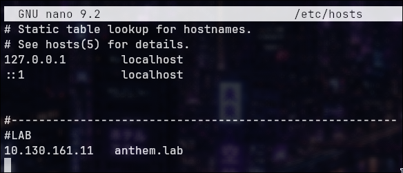


### Port Enumeration

```bash
nmap -sC -sV -p- anthem.lab --min-rate 500 -o ports.txt
```


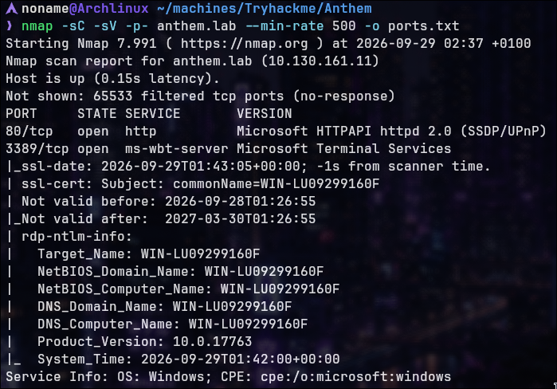


**Open Ports:**

- **80/tcp** — HTTP (Microsoft HTTPAPI httpd 2.0)
- **3389/tcp** — RDP (Microsoft Terminal Services)

**Service Information:**

- OS: Windows
- Target Name: WIN-LU09299160F

**Reconnaissance Finding:** Single web service on port 80; RDP available on standard port 3389. No complex services; focus is on web application enumeration.

---

## Web Application Enumeration

### Homepage Access

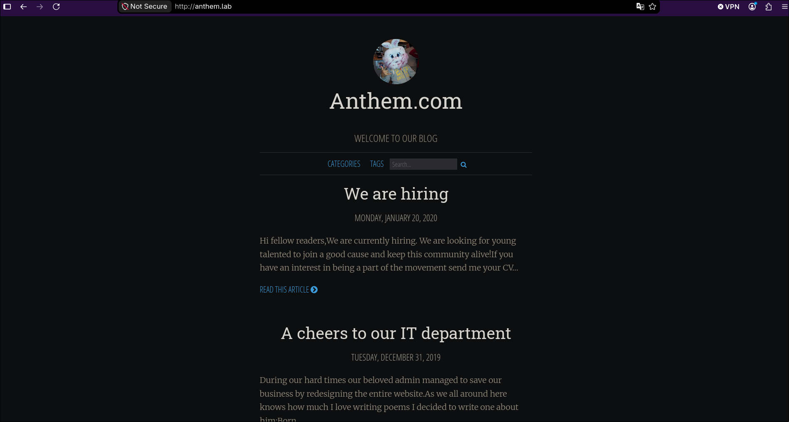

Navigate to `http://anthem.lab`:

**Page Content:**

- Blog-style application: "Anthem.com"
- Two blog posts visible:
    1. "We are hiring" (January 20, 2020)
    2. "A cheers to our IT department" (December 31, 2019)


### Directory Enumeration

```bash
gobuster dir -u http://anthem.lab -w /usr/share/seclists/Discovery/Web-Content/big.txt
```

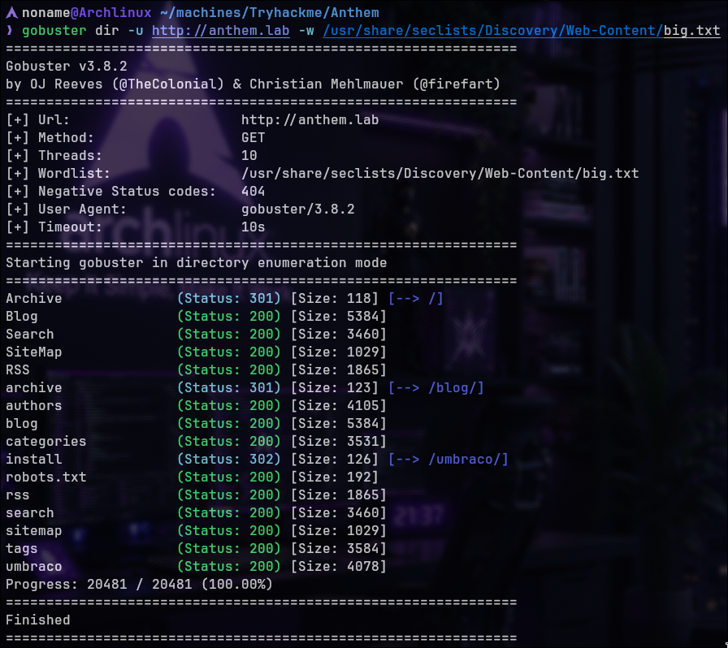


**robots.txt Analysis**

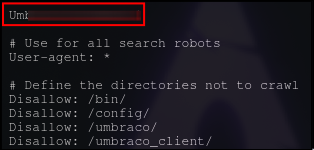


**Finding:** First answer discovered: `{REDACTED}` (password hint from robots.txt)

---

## OSINT Research

### Blog Post Analysis


**Content Analysis:**

- Blog post dated December 31, 2019
- Author: James Orchard Halliwell
- Message about beloved admin saving business through website redesign
- Contains poem about the admin

**Poem Content:**

```
Born on a Monday,
Christened on Tuesday,
Married on Wednesday,
Took ill on Thursday,
Grew worse on Friday,
Died on Saturday,
Buried on Sunday.
That was the end...
```

**Discovery:** This poem matches famous English nursery rhyme content.

### Nursery Rhyme Identification

Research the poem via Google/Wikipedia (OSINT):

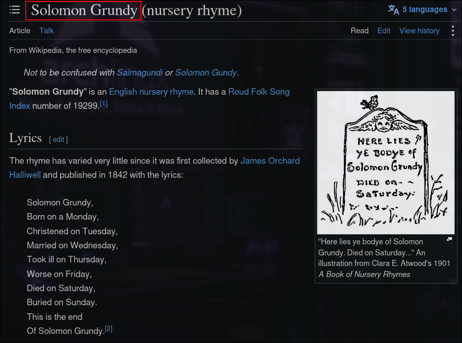


**Finding:** The poem is the English nursery rhyme "Solomon Grundy"

**Key Information:**

- Nursery rhyme from English folklore
- First collected by James Orchard Halliwell (same author as blog post)
- Full name: Solomon Grundy (not a typical administrator name)
- Published in 1842

**Lab Context:** The lab question asks for "administrator name" — the answer is the nursery rhyme character name: **Solomon Grundy**

---

## Credential Inference

### Email Pattern Discovery


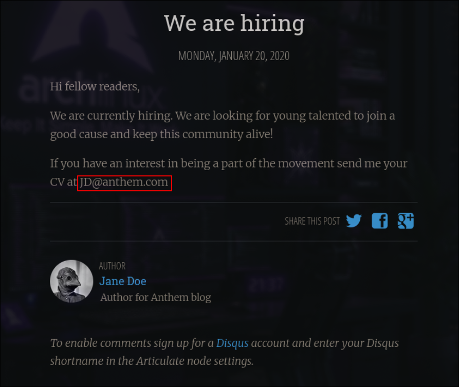


From "We are hiring" blog post:

**Visible Email:** `JD@anthem.com`

**Pattern Analysis:**

- Email format: `[Initials]@anthem.com`
- JD = Jane Doe (author of hiring post)
- Following same pattern for Solomon Grundy = SG@anthem.com

---

### Application-Level Flags


#### Flag 1: Hidden in Application

Inspect application search form in browser developer tools:
  

  

**Flag 1 (Application):** {REDACTED} -- Found in html code in first blog:

http://anthem.lab/archive/we-are-hiring/

#### Flag 2: Hidden in Application

  

  

**Flag 2 (application):** {REDACTED} -- Found in html code on index:

http://anthem.lab/authors/

#### Flag 3: Hidden in Application


  
**Flag 3(application):** {REDACTED} -- Found navigating to Jane Doe profile: http://anthem.lab/authors/jane-doe/

  


**Flag 4(application):** {REDACTED} -- Found in html code on the second blog: http://anthem.lab/archive/a-cheers-to-our-it-department/


---

### Username Inference

**RDP Username Discovery:**

- Email: `SG@anthem.com`
- RDP Username: `SG`

**Username Inference:** Based on the email naming convention observed in the application, `Solomon Grundy` maps to `SG@anthem.com`. The same username prefix, `SG`, was then used for the RDP login.

**Credentials Formulated:**

```
Email: SG@anthem.com
Username: SG
Password: {REDACTED} (from robots.txt discovery)
```


---

## Remote Access

### RDP Connection

```bash
xfreerdp3 /v:anthem.lab /u:SG /p:{REDACTED}
```


**Connection Successful:** Interactive Windows desktop session established as user SG and get the first flag on Desktop

**File Found:** `user.txt`

## Finding Hidden Folders:

The lab provides a hint: "hidden" — indicating sensitive data is concealed within hidden system folders. Enable discovery of hidden files and directories:

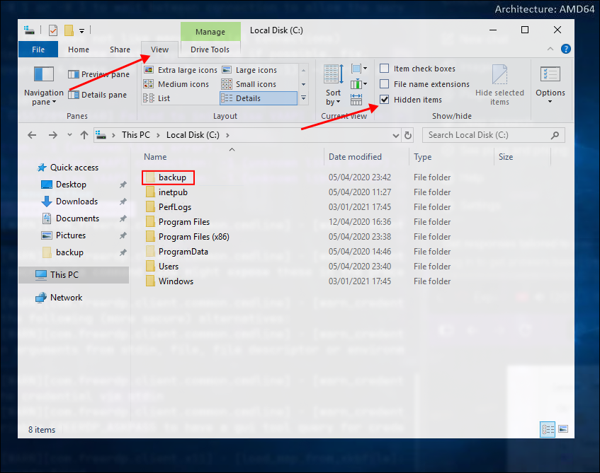

**Discovery Result:** Hidden backup directory located at `C:\backup\`


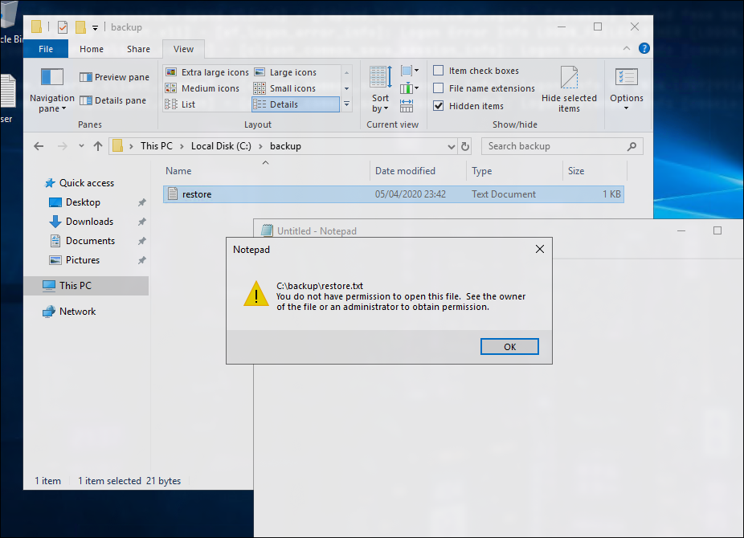

Restore.txt spotted on backup folder

**Access Denied:** File `restore.txt` requires elevated permissions for read operations

Let's see who's is owner

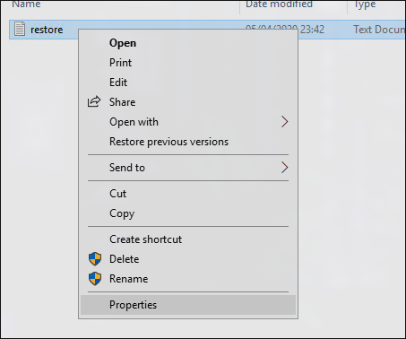


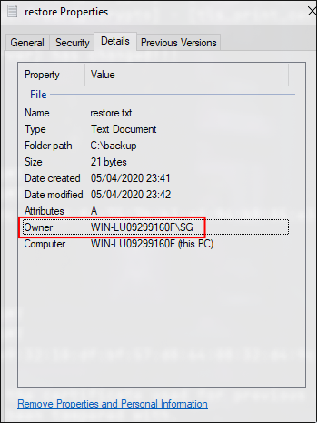

**Current User:** SG (verified as owner of file)

**Ownership Status:** User SG owns the resource but lacks read/execute permissions

### Permission Escalation to Hidden Folder

Since SG owns `restore.txt`, the user can modify the file's permissions without requiring administrative credentials.

**Escalation Step-by-step:**

Starting in properties

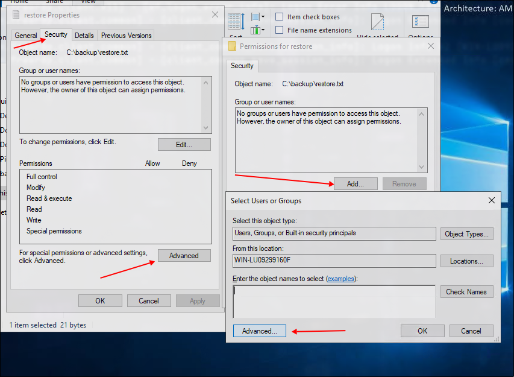


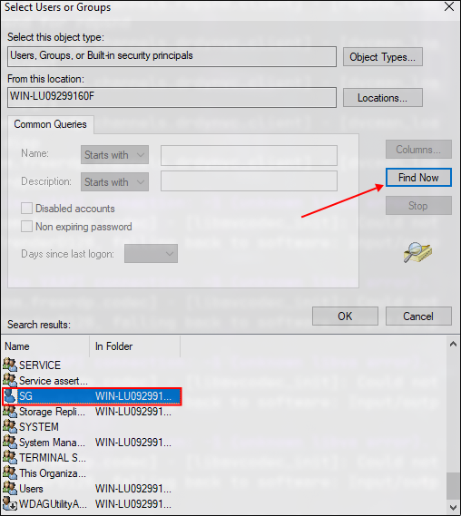

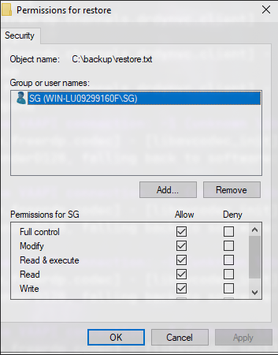

Then just have to allowing all permission!

**Result:** SG gains the required permissions to access `restore.txt`.

### Backup Folder Contents

After permissions are elevated, browse backup folder:

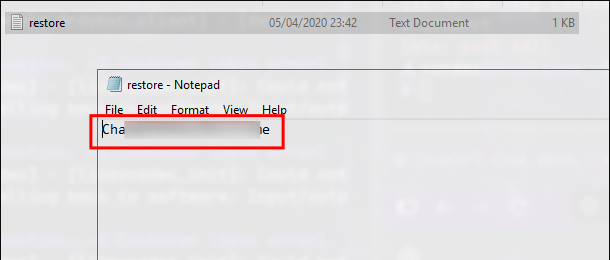


---
### Administrator Flag

Navigate to Administrator user profile directory:

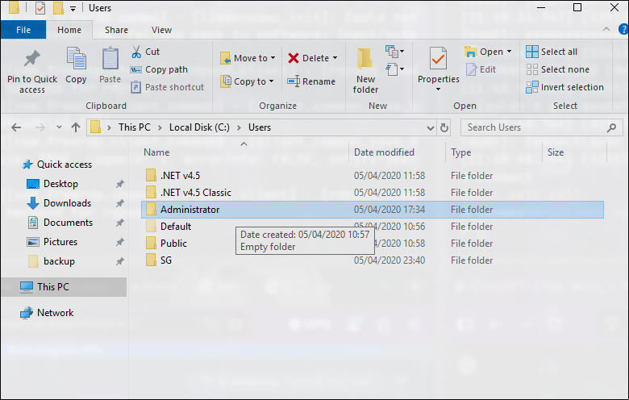


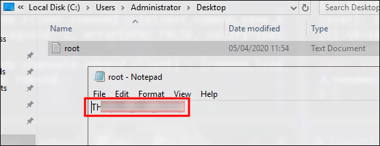

Reach the last flag on C:\Users\Administrator\Desktop\

**Flag (Administrator):** `TI...` (REDACTED)

---
> Made by [NonamesecX](https://github.com/NonamesecX) | For educational purposes only