# Attacktive Directory — TryHackMe Complete Writeup

**Difficulty:** Medium                                                                             
**Operating System:** Windows
**Category:** Active Directory Enumeration + Kerberos Enumeration

---

## Reconnaissance

### Initial Setup

Configure local hostname resolution for domain communication:


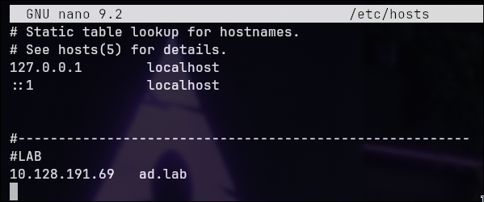


### Port Enumeration


```bash
nmap -sC -sV -p- ad.lab --min-rate 500 -o ports.txt
```

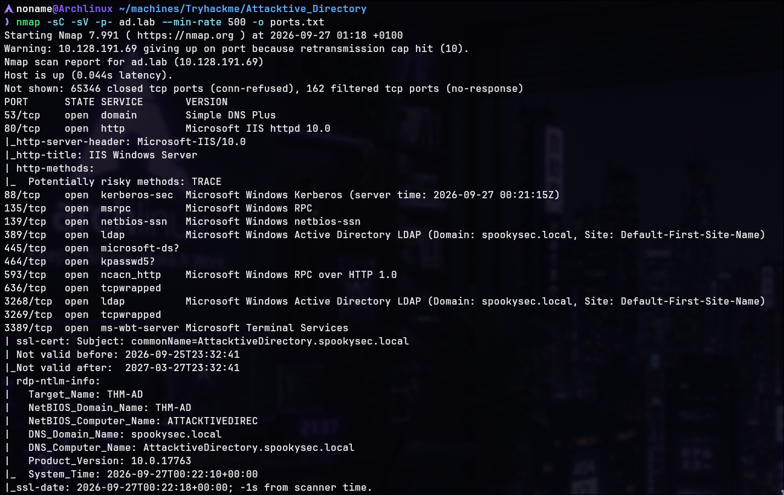

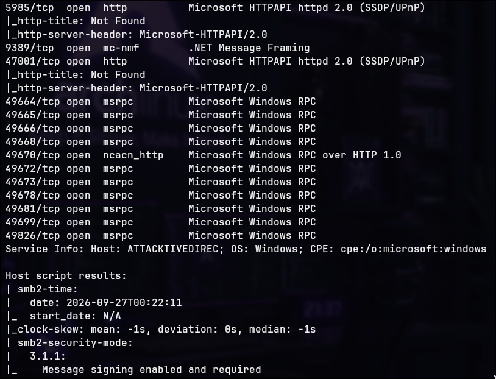

**Critical Services Identified:**

|Port|Service|Version|Purpose|
|---|---|---|---|
|53|DNS|Microsoft DNS|Domain name resolution|
|88|Kerberos|Microsoft Kerberos|Authentication protocol (vulnerable to AS-REP roasting)|
|135|RPC|Windows RPC|Remote Procedure Call|
|139|NetBIOS-SSN|Windows SMB|Legacy file sharing|
|389|LDAP|Active Directory LDAP|User/group enumeration|
|445|SMB|Windows SMB|File sharing (contains backup_credentials.txt)|
|3268|LDAP GC|Active Directory Global Catalog|Distributed directory lookups|
|3389|RDP|Terminal Services|Remote Desktop|

**Extracted Information:**

Domain: spookysec.local
Domain Controller: AttacktiveDirectory.spookysec.local
NetBIOS Name: ATTACKTIVEDIREC
OS Version: Windows Server 2019 (10.0.17763)

**Reconnaissance Finding:** Standard AD environment with all required services. No obvious patching gaps at surface level, but AD misconfigurations are the real vulnerability.

---

## Kerberos User Enumeration

### Why Kerbrute Works

**Kerberos Pre-Authentication Mechanism:**

- Normal: Client sends username + encrypted timestamp (proves password knowledge) → KDC issues TGT
- Vulnerable: Pre-auth disabled accounts allow TGT request without authentication
- Kerbrute enumeration: Sends AS-REQ messages; different KDC responses indicate valid/invalid usernames

### User Enumeration


```bash
kerbrute userennum --dc AttacktiveDirectory.spookysec.local -d spookysec.local userlist.txt
```


**Valid Users Enumerated:**

Complete list of discovered users:

- james@spookysec.local
- svc-admin@spookysec.local **← HAS PRE-AUTH DISABLED**
- backup@spookysec.local
- administrator@spookysec.local
- darkstar@spookysec.local
- robin@spookysec.local
- ori@spookysec.local
- And others (JAMES, ROBIN, Darkstar, Paradox, etc.)

**Critical Discovery:** svc-admin shows "no pre-authentication required" flag — this account is vulnerable to AS-REP roasting.

---

## AS-REP Roasting Attack


Use Impacket's GetNPUsers tool to extract AS-REP hash:


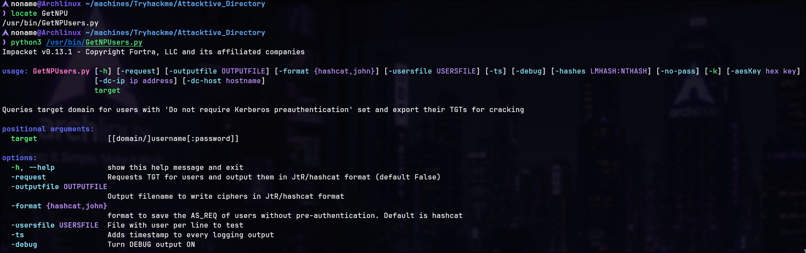

Usage:
```bash
python3 /usr/bin/GetNPUsers.py spookysec.local/ -dc-ip ad.lab -usersfile validusers.txt -request
```

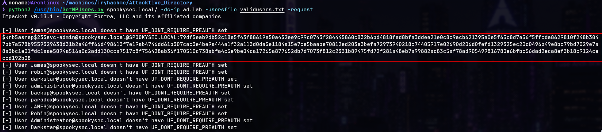


**Extracted AS-REP Hash:**

```
$krb5asrep$23$
```
### Encryption Type Selection & Cracking Difficulty

**Critical Discovery:** Kerbrute initially captured an AS-REP using **etype 18 (AES256-CTS-HMAC-SHA1-96)**, which proved impractical to crack with the available resources. A subsequent request using `GetNPUsers.py` returned an **etype 23 (RC4-HMAC)** AS-REP for the same `svc-admin` account, which could be cracked using the provided wordlist.

**Why This Occurs:**

Kerberos supports multiple encryption types. The KDC can select the encryption type based on the types requested and supported by the client and account. In this case, the two AS-REP responses used different encryption types: **AES256 (etype 18)** and **RC4-HMAC (etype 23)**.

**Cracking Decision:**

The etype 23 response was selected for offline password cracking because RC4-HMAC is substantially more practical for password-guessing workloads than AES-based AS-REP material in this lab environment.

 **Both AS-REP responses belong to the same user account (`svc-admin`). The difference is the encryption type used to protect the AS-REP material: etype 18 (AES256) versus etype 23 (RC4-HMAC).**


---

## Hash Cracking

### Hash Type Identification


Research the hash format:

- **Hash Format:** Kerberos 5 etype 23 AS-REP
- **Hash Type:** 18200 (Kerberos 5 AS-REP etype 23)

### Offline Cracking with John

```bash
john hash.txt --wordlist=passlist.txt
```

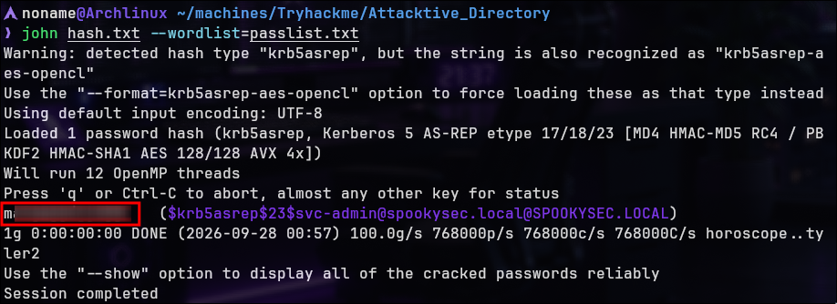


**Credentials Obtained:**

```
svc-admin:{REDACTED}
```

---

## SMB Enumeration & Credential Discovery

### Enumerating Available Shares

```
smbclient -L //ad.lab -U svc-admin --password={password}
```

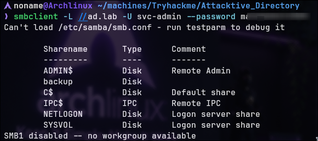

**Available Shares:**

| Share      | Type | Comment            |
| ---------- | ---- | ------------------ |
| ADMIN$     | Disk | Remote Admin       |
| **backup** | Disk | (empty comment)    |
| c$         | Disk | Default share      |
| IPC$       | IPC  | Remote IPC         |
| NETLOGON   | Disk | Logon server share |
| SYSVOL     | Disk | Logon server share |

**Why This Matters:** svc-admin has sufficient permissions to access multiple shares including 'backup' — unusual for a standard service account and indicates privilege misconfiguration.

### Accessing Backup Share


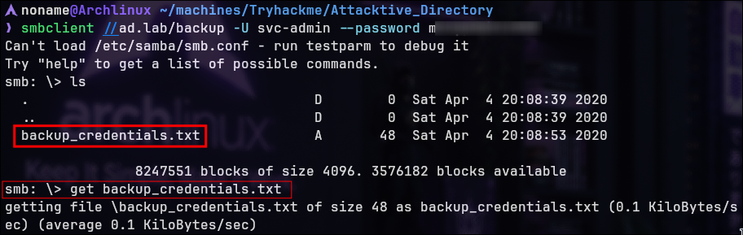


**Directory Contents:** backup_credentials.txt

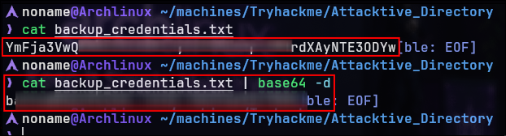

**File Contents:**

`YmFja3VwQ...`

**Format:** Base64 encoded credentials

```bash
cat backup_credentials.txt | base64 -d
```

---

**Lab Environment Context:**

> "Now that we have new user account credentials, we may have more privileges on the system than before. The username of the account 'backup' gets us thinking. What is this backup account to?
> 
> Well, it is the backup account for the Domain Controller. This account has a unique permission that allows all Active Directory changes to be synced with this user account. This includes password hashes."

**Critical Finding:** The 'backup' user account has **DC Sync rights** — it can request all password hashes from the domain controller by synchronizing Active Directory changes.

---

## DC Sync Attack

### Understanding DC Sync

**What is DC Sync?** DC Sync is a legitimate Active Directory feature that allows domain controllers to synchronize. The 'backup' account has been granted these rights, creating a critical privilege escalation path:

1. Backup account can request password hashes
2. These hashes can be used for Pass-the-Hash attacks
3. Complete domain compromise becomes possible

### Using secretsdump.py

Usage:

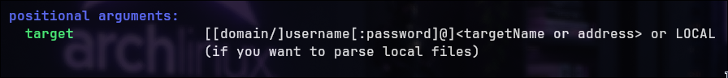

```bash
secretsdump.py spookysec.local/{REDACTED}@ad.lab
```

### Extracting All Domain Hashes

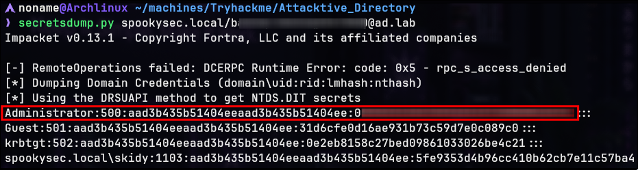


**What This Means:**

- **Administrator NTLM hash extracted**
- **All user password hashes are visible**
- **krbtgt hash accessible** (enables Golden Ticket attacks)
- **Complete domain compromise possible**


---

## Pass-the-Hash to Administrator Shell

### Using evil-winrm for RCE

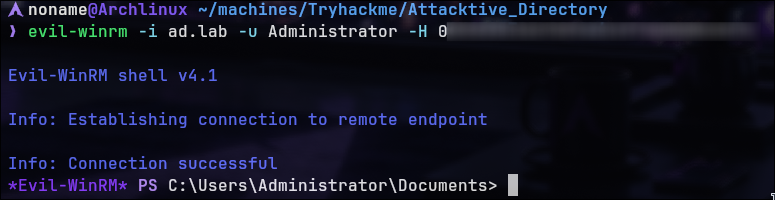

**Evil-WinRM Flags:**

- `-i` → IP/hostname of target
- `-u` → Username (Administrator)
- `-H` → NTLM hash (from secretsdump output)

**Connection Established:**

**Why This Works:**

- Windows allows authentication via NTLM hash (Pass-the-Hash)
- Evil-WinRM uses this to establish WinRM session
- Administrator privileges grant full system access

---

## Flag Capture

### User Flag (svc-admin)

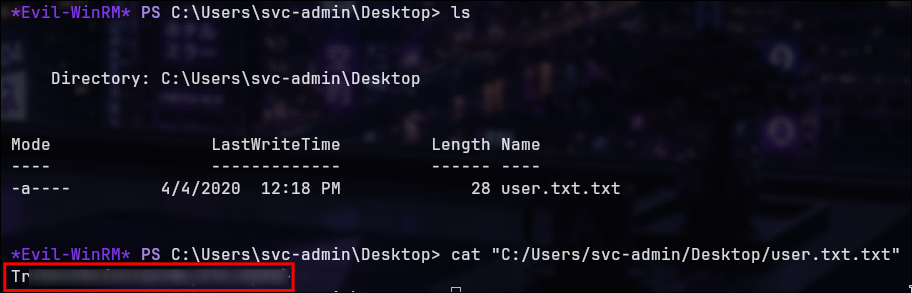

Navigate to first user's desktop:

```powershell
PS C:\Users\svc-admin\Desktop> cat user.txt.txt
```

**User Flag:** `TR...`

### PrivEsc Flag (backup User)

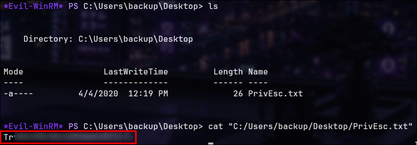

Access backup account's desktop:

```powershell
PS C:\Users\backup\Desktop> cat PrivEsc.txt
```

**PrivEsc Flag:** `TR...`

### Root Flag (Administrator)

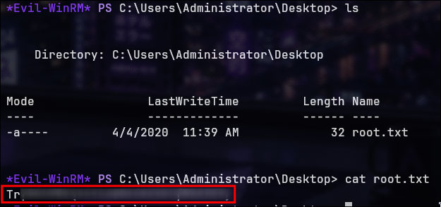

Access administrator desktop from WinRM session:

```powershell
PS C:\Users\Administrator\Desktop> cat root.txt
```

**Root Flag:** `TR...`

---
> Made by [NonamesecX](https://github.com/NonamesecX) | For educational purposes only

