# Basic Pentest — TryHackMe Writeup

**Difficulty:** Easy  
**Operating System:** Linux

---

## Reconnaissance

### Setup /etc/hosts

Configure local hostname resolution:

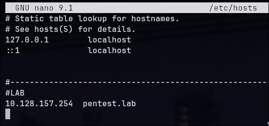

### Port Enumeration

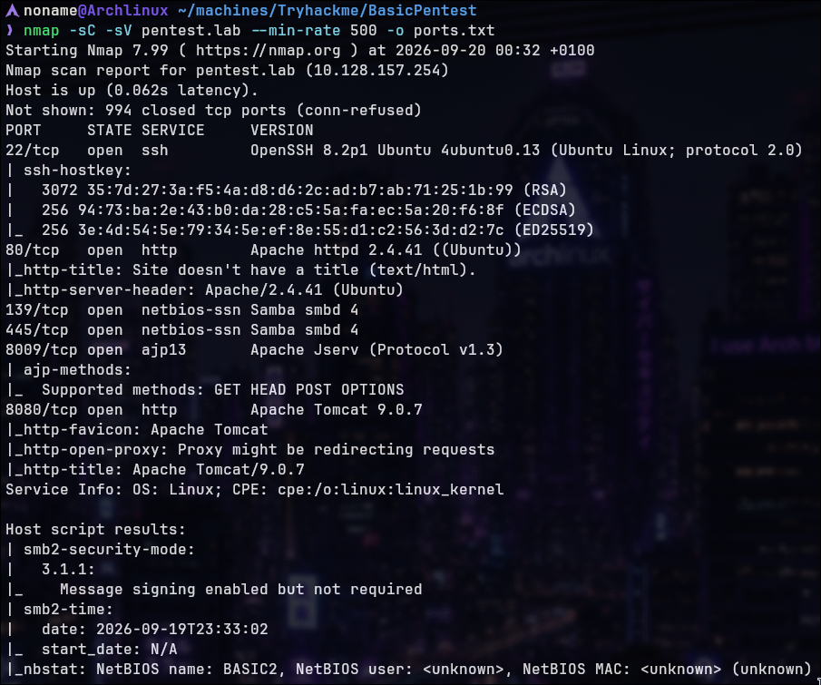

---

### Web Services Identified

- **22/tcp** — SSH (OpenSSH 8.2p1)
- **80/tcp** — HTTP (Apache 2.4.41)
- **139/tcp** — NetBIOS-SSN (Samba smbd 4)
- **445/tcp** — NetBIOS-SSN (Samba smbd 4)
- **8009/tcp** — Apache JServ (Protocol v1.3)
- **8080/tcp** — HTTP (Apache Tomcat 9.0.7)

**Key Finding:** Multiple web services and SMB file sharing.

---

## Web Enumeration

### Port 80 — Apache HTTP


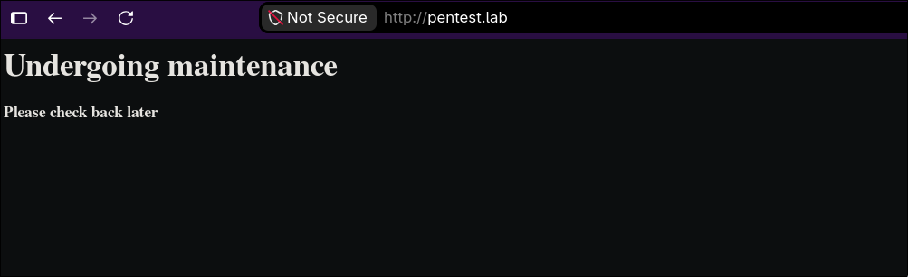

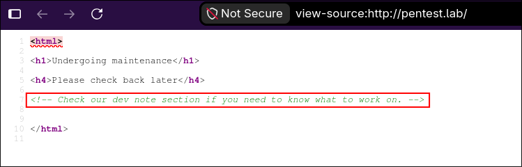)
View-source analysis

Accessing `http://pentest.lab/` displays maintenance page with HTML comment indicating developer notes section exists.

### Directory Enumeration


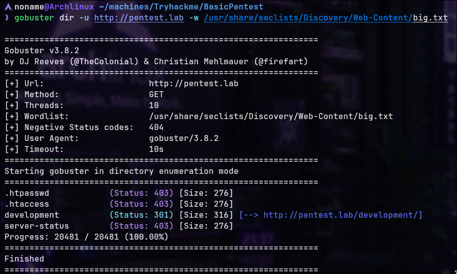

**`/development/` (301 redirect)**


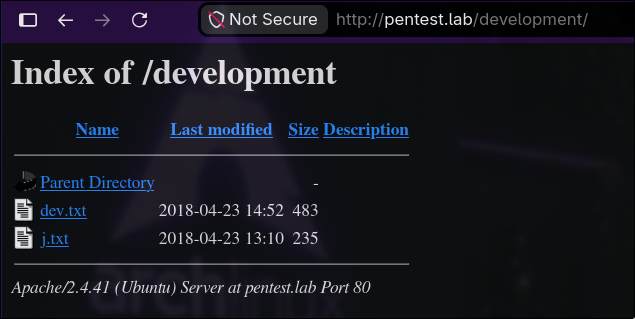


- `/development/dev.txt`
- `/development/j.txt`

### Developer Notes — dev.txt


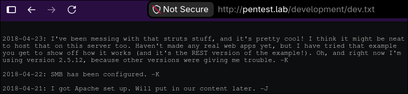

**Key Information:**

- Two potencially developers identified: J and K
- Struts framework being tested (version 2.9.12)

### Developer Notes — j.txt


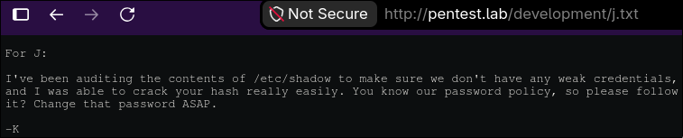


**Finding:** K mentions auditing shadow file and cracking J's password. J has weak credentials.

---

## SMB Enumeration

### Share Discovery


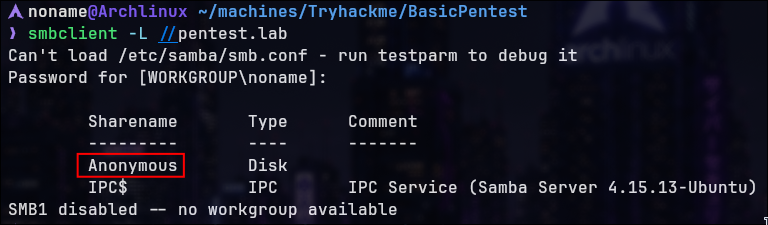


**Available Shares:**

- `Anonymous` (Disk) — No authentication required
- `IPC$` (IPC Service)

**Critical Finding:** Anonymous SMB access enabled.

### Anonymous Share Access


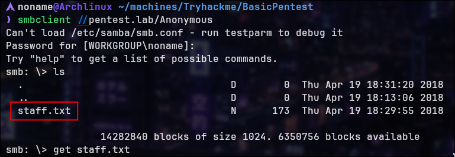


**Files Found:**

- `staff.txt`

### File Content


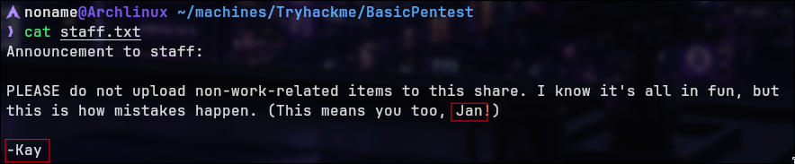


**Analysis:** Staff announcement confirms Jan is employee. File serves as reminder of policy violations.

---

## Credential Discovery & SSH Brute Force

### Identified Usernames

From SMB analysis and developer notes:

- J = **jan** — identified as weak user (password cracked by Kay)
- K = **kay** — identified as strong user

### SSH Brute Force Attack


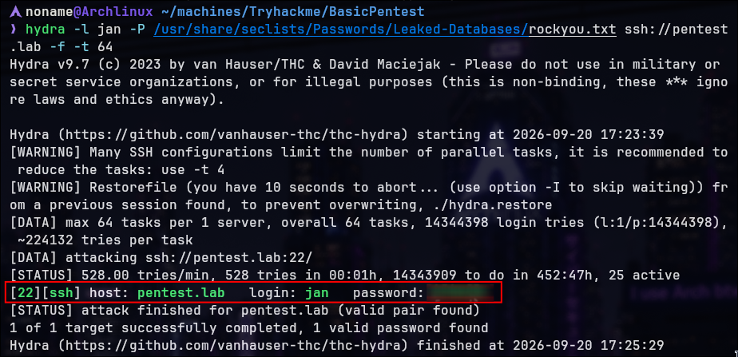


**Result:** Valid credentials obtained for Jan via rockyou.txt wordlist.

---

## Initial access on ssh 

### SSH Connection as Jan

**Shell Obtained:** `jan@pentest.lab`

**Shell Upgrade**

```bash
export TERM=xterm-256color
```

### Home Directory Reconnaissance

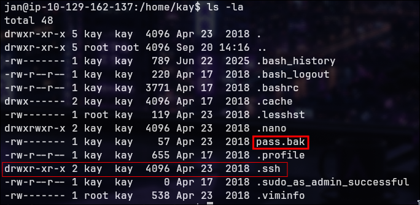

**Finding:** Jan has read access to Kay's home directory. File `pass.bak` visible.

---

## SSH Key Discovery & Extraction

### SSH Directory Contents

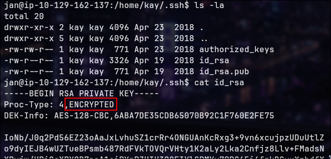

**Encrypted Private Key**

**Finding:** Key is encrypted with AES-128-CBC and requires passphrase.

Save this file to try to connect the service with correct permisions for SSH `chmod 600`

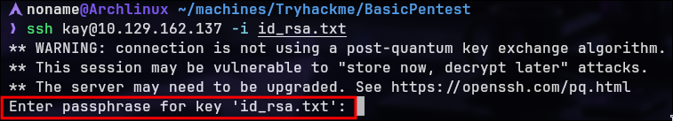

Try to connect confirms need a passphrase

---

## SSH Key Passphrase Cracking

### SSH Key Format Conversion


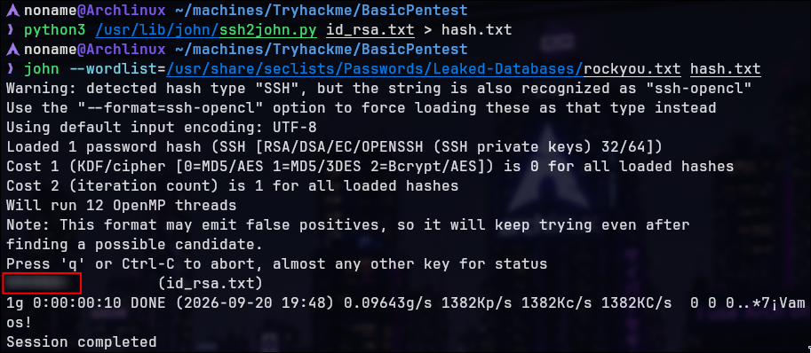

**Result:** Passphrase cracked successfully.

---

## Privilege Escalation to Kay

### SSH Login via Private Key

```
ssh kay@pentest.lab -i id_rsa.txt
```

Confirm the passphrase and login.


**Shell Obtained:** `kay@pentest.lab` (via SSH key authentication)


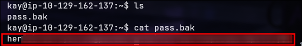


**Finding:** Final objective achieved. Passphrase/password revealed.

---

## Attack Chain Summary

|#|Stage|Method|Result|
|---|---|---|---|
|1|Reconnaissance|Nmap|Services mapped|
|2|Web Enumeration|Gobuster|Developer notes found|
|3|Developer Analysis|File reading|Jan identified as weak user|
|4|SMB Enumeration|Anonymous access|Staff file extracted|
|5|SSH Brute Force|Hydra + rockyou.txt|Jan credentials obtained|
|6|Initial Access|SSH login|Jan shell achieved|
|7|Permission Check|Directory listing|SSH files readable by Jan|
|8|Key Extraction|File reading|Encrypted private key obtained|
|9|Format Conversion|ssh2john|Key converted to John format|
|10|Passphrase Crack|john|SSH key passphrase cracked|
|11|Lateral Move|SSH key login|Kay account compromised|
|12|Flag Capture|File reading|Final objective achieved|

---

> Made by NonamesecX | For educational purposes only

