# SimpleCTF — Writeup

**Difficulty:** Easy  
**Operating System:** Linux

---

## Reconnaissance

### Setup /etc/hosts

Configure local hostname resolution:

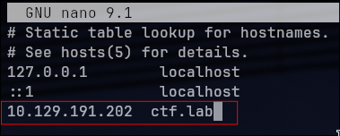
### Nmap Scan — Full Port Enumeration

Perform comprehensive port scanning to identify services:

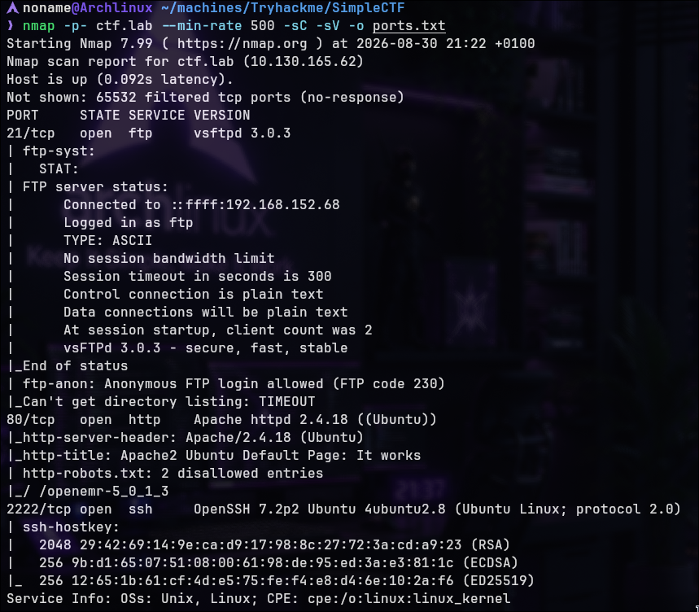

**Initial Observations:**

- FTP service with vSFTPd 3.0.3 (allows anonymous login)
- Apache web server on port 80
- SSH on non-standard port 2222

---

## Service Enumeration

### FTP Enumeration — Anonymous Access

Connect to FTP with anonymous credentials:

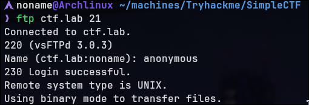

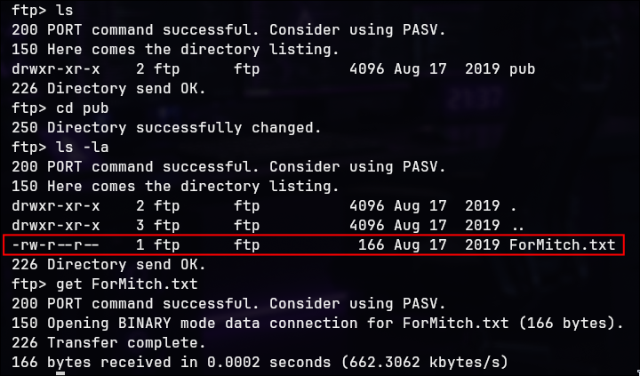

**File Contents:**

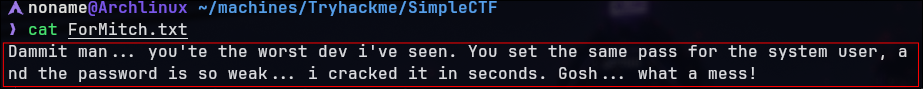

The message suggests:

- System user has a weak password
- Possible username: "mitch" (implied from message context)
- Credentials may be reused across services

### HTTP Reconnaissance

Default apache page on the web application

Enumerate web directories to discover hidden paths:

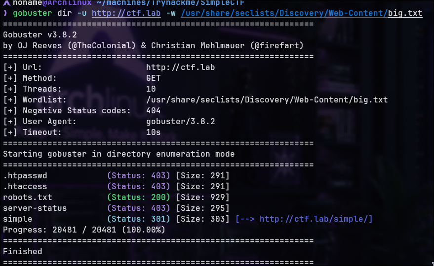

**Redirect Discovery:**

Accessing `/simple/` reveals a CMS application.

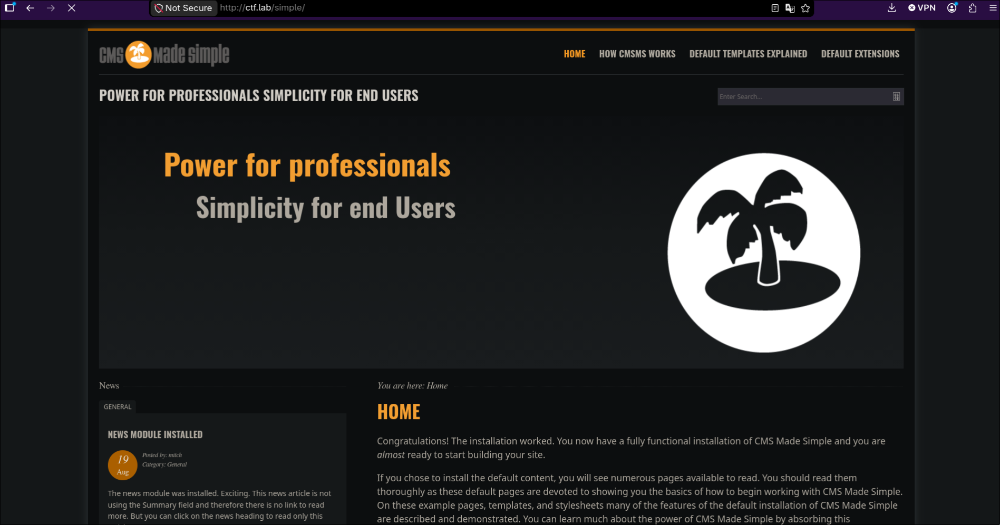

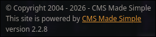

**Application Name:** CMS Made Simple™  
**Version:** 2.2.8  
**Tagline:** "Power for professionals. Simplicity for end users."

There a critical CVE for this CMS version

---

## Vulnerability Analysis

### Identify CVE-2019-9053

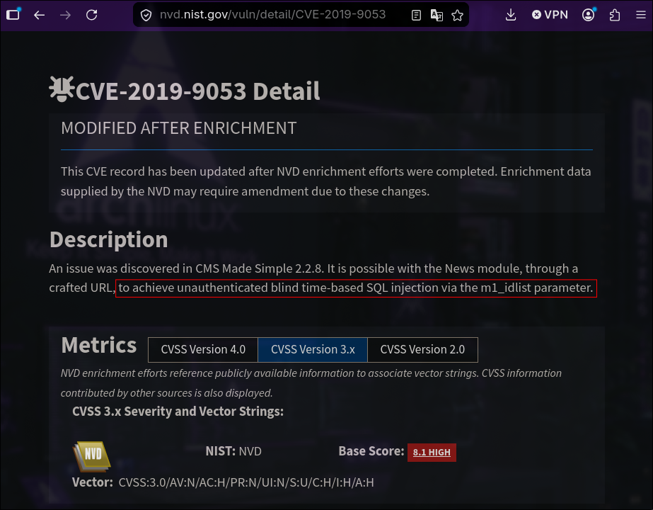

REFERER:https://nvd.nist.gov/vuln/detail/cve-2019-9053

**CVSS Score:** 8.1 (High)  

Search searchsploit CMS Made Simple 2.2.8 vulnerabilities:


---

## Exploitation

### Prepare Exploit Environment

**Clone/Download Exploit:**

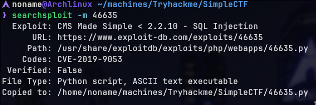

**Set Up Virtual Environment (Python 2 compatibility):**

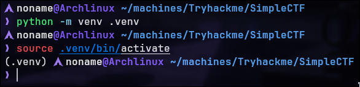

**Analyze Exploit Code:**

The exploit uses time-based SQL injection to extract:

- User credentials (salt, username, password hash, email)
- Database structure information

Exploit usage:
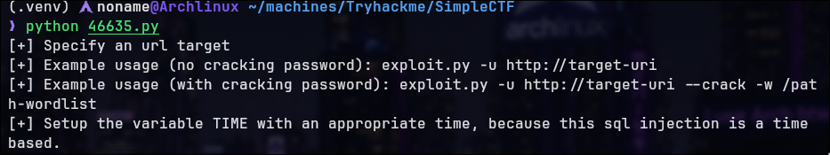

### Execute SQL Injection Exploit

**Exploit Command:**

```bash
python 46635.py -u http://ctf.lab/simple --crack -w /path/to/rockyou.txt
```

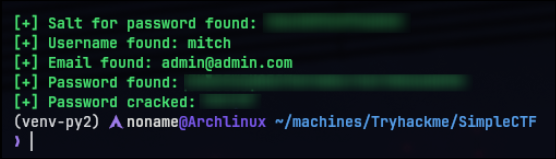


---

## Initial Access

### SSH Access as mitch

Connect via SSH on non-standard port 2222:

```bash
ssh mitch@ctf.lab -p 2222
```

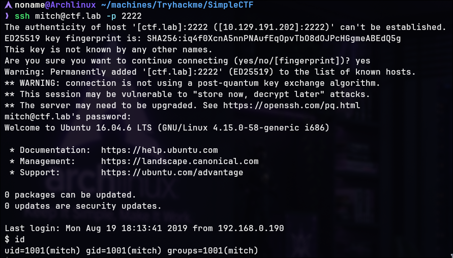

/home/mitch:

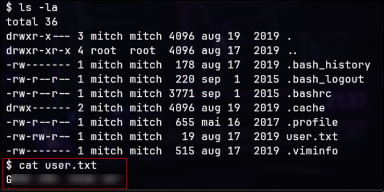

---

## Privilege Escalation

`sudo -l`

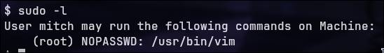

**Analysis:**

- User `mitch` can execute `/usr/bin/vim` as root without password
- This is a critical misconfiguration
- Vim editor allows shell command execution via `:!command` syntax

### Privilege Escalation via Vim

The Vim editor, when executed with sudo privileges, can spawn an interactive shell:

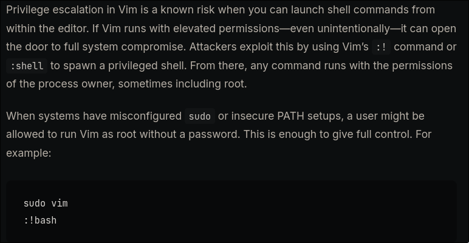

REFERER:https://hoop.dev/blog/privilege-escalation-in-vim-a-simple-path-to-root


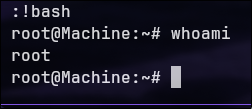

---

Made by NonamesecX | For educational purposes only
